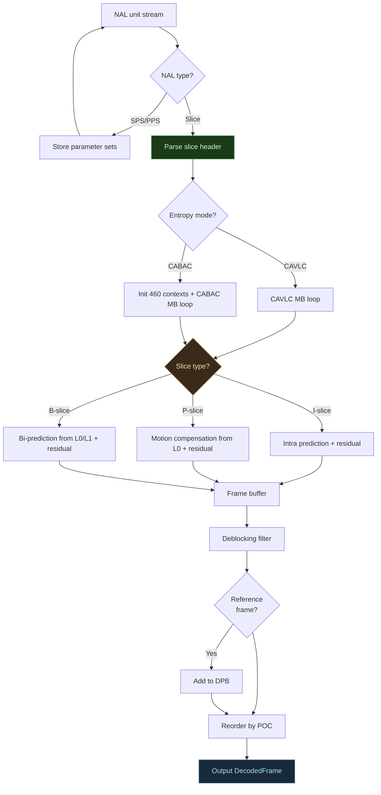
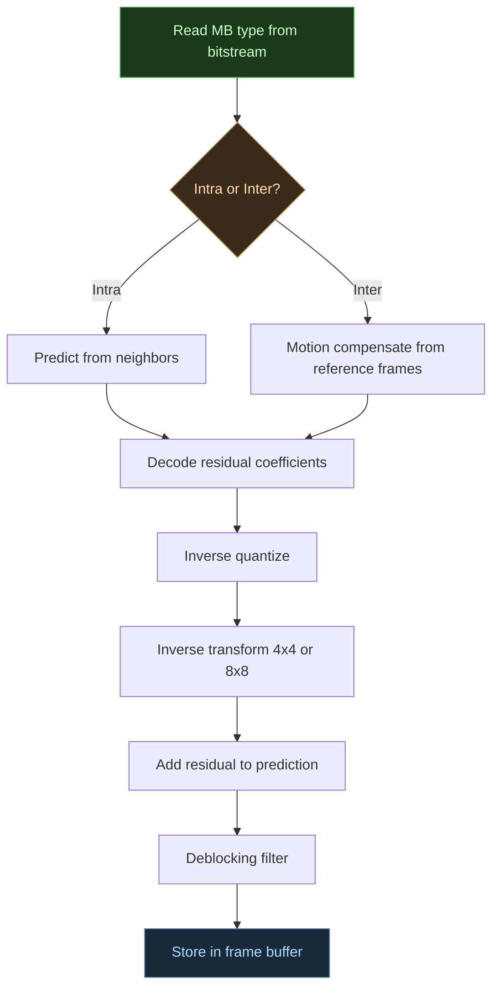
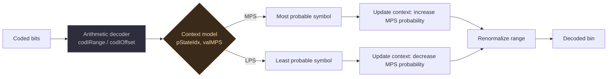

# h264-decoder

[](https://www.python.org/)
[](LICENSE)
[](#running-tests)
[](#supported-features)

A pixel-perfect H.264 video decoder written from scratch in pure Python and NumPy.

Decodes real MP4 files downloaded from the internet — no C extensions, no FFI, no dependencies on existing codec libraries. Built to understand how video compression actually works.


<details>
<summary>With pixel diff visualization (click to expand)</summary>


</details>

## What it does

```python
from decoder.decoder import H264Decoder

decoder = H264Decoder()

# Decode an MP4 from the internet
for frame in decoder.decode_file("big_buck_bunny.mp4"):
    print(f"{frame.width}x{frame.height}")
    y, cb, cr = frame.luma, frame.cb, frame.cr  # YUV 4:2:0
    rgb = frame.to_rgb()                         # or RGB
```

## Pixel-perfect accuracy

Verified against ffmpeg on real internet videos — zero pixel difference across Y, Cb, and Cr channels:

| Video | Resolution | Max pixel diff |
|-------|-----------|---------------|
| Big Buck Bunny | 640x360 | **0** |
| Big Buck Bunny | 1280x720 | **0** |
| Jellyfish | 640x360 | **0** |
| Sintel | 640x360 | **0** |

## Supported features

| Feature | Status |
|---------|--------|
| **Profiles** | Baseline, Main, High |
| **Entropy coding** | CAVLC, CABAC |
| **Frame types** | I, P, B |
| **Intra prediction** | 4x4 (9 modes), 8x8 (9 modes), 16x16 (4 modes) |
| **Inter prediction** | All partition sizes, sub-pixel interpolation, weighted prediction |
| **Transforms** | 4x4 IDCT, 8x8 IDCT, Hadamard |
| **Deblocking filter** | Full implementation |
| **Container** | Raw H.264 (Annex B), MP4 |
| **Reference management** | DPB, MMCO, reference list reordering |

## Decoding pipeline

Each module maps to a stage of the H.264 spec. The full pipeline, from
container bytes to RGB output:



### How a frame is decoded

The decoder processes one NAL unit at a time. SPS/PPS NALs are stored. Slice
NALs trigger the full macroblock-by-macroblock decode loop. After all MBs in a
picture are decoded, the deblocking filter runs across the entire frame, and
the result is either stored in the decoded picture buffer (for reference frames)
or output in display order.



```mermaid
flowchart LR
    A["MP4 / Annex B
    container/"] --> B["NAL Parser
    bitstream/"]
    B --> C["SPS / PPS
    parameters/"]
    C --> D["Slice Header
    slice/"]
    D --> E["Entropy Decode
    entropy/"]
    E --> F["Dequantize
    dequant/"]
    F --> G["Inverse Transform
    transform/"]
    G --> H["Prediction
    intra/ inter/"]
    H --> I["Reconstruct
    reconstruct/"]
    I --> J["Deblock
    deblock/"]
    J --> K["Output
    color/"]

    style A fill:#2d2d3d,stroke:#555,color:#ccc
    style B fill:#2d2d3d,stroke:#555,color:#ccc
    style C fill:#2d2d3d,stroke:#555,color:#ccc
    style D fill:#2d2d3d,stroke:#555,color:#ccc
    style E fill:#2d2d3d,stroke:#555,color:#ccc
    style F fill:#2d2d3d,stroke:#555,color:#ccc
    style G fill:#2d2d3d,stroke:#555,color:#ccc
    style H fill:#2d2d3d,stroke:#555,color:#ccc
    style I fill:#2d2d3d,stroke:#555,color:#ccc
    style J fill:#2d2d3d,stroke:#555,color:#ccc
    style K fill:#2d2d3d,stroke:#555,color:#ccc
```

### How a macroblock is decoded



### CABAC binary arithmetic decoding



## Project structure

```
h264-decoder/
├── bitstream/       # NAL unit parsing, bit-level I/O
├── parameters/      # SPS/PPS parsing
├── slice/           # Slice header, weight tables
├── entropy/         # CAVLC and CABAC decoding
├── dequant/         # Inverse quantization, scaling lists
├── transform/       # 4x4 and 8x8 IDCT, Hadamard
├── intra/           # Intra prediction (4x4, 8x8, 16x16)
├── inter/           # Inter prediction, motion compensation
├── deblock/         # Deblocking filter
├── reconstruct/     # Macroblock reconstruction
├── color/           # YCbCr to RGB conversion
├── container/       # MP4 demuxer
├── decoder/         # Main decoder orchestration
├── test_data/       # Test streams (not tracked, see below)
└── docs/            # Architecture docs, spec mapping
```

## Module overview

Each module corresponds to a stage in the H.264 spec. They are listed here in
pipeline order, from input to output.

| Module | Spec Section | What it does |
|--------|-------------|--------------|
| [`container/`](container/) | ISO 14496-12/15 | MP4 demuxer: parses box hierarchy, extracts NALs from `avcC`, converts AVCC length-prefixed format to Annex B start codes |
| [`bitstream/`](bitstream/) | Annex B, Sec 7.2 | NAL unit framing (start code detection, emulation prevention byte removal) and `BitReader` for exp-Golomb / fixed-width reads |
| [`parameters/`](parameters/) | Sec 7.3.2 | SPS and PPS parsing: profile/level, picture dimensions, reference frame limits, scaling lists, VUI |
| [`slice/`](slice/) | Sec 7.3.3 | Slice header parsing: slice type, QP, reference list modification, weighted prediction tables, MMCO commands |
| [`entropy/`](entropy/) | Sec 9 | CAVLC (run-level VLC tables) and CABAC (binary arithmetic decoder with 460 context models, binarization, context derivation) |
| [`dequant/`](dequant/) | Sec 8.5.12 | Inverse quantization with position-dependent scaling matrices, 4x4 and 8x8 scaling list support for High Profile |
| [`transform/`](transform/) | Sec 8.5.12 | Integer 4x4 and 8x8 inverse DCT (butterfly), 4x4 Hadamard (luma DC, chroma DC) |
| [`intra/`](intra/) | Sec 8.3.1-8.3.3 | Intra prediction: 4x4 (9 modes), 8x8 (9 modes with reference sample filtering), 16x16 (4 modes), chroma (4 modes) |
| [`inter/`](inter/) | Sec 8.4 | Motion vector prediction (median), motion compensation (6-tap quarter-pel interpolation), B-frame bi-prediction, weighted prediction, direct mode |
| [`reconstruct/`](reconstruct/) | Sec 8.5 | Macroblock assembly: prediction + dequant + transform + clip, for all MB types |
| [`deblock/`](deblock/) | Sec 8.7 | In-loop deblocking filter: boundary strength calculation (bS 0-4), adaptive 4-tap / 3-tap filtering on block edges |
| [`color/`](color/) | Annex E | YCbCr to RGB conversion: BT.601 and BT.709 matrices, 4:2:0/4:2:2/4:4:4 chroma upsampling |
| [`decoder/`](decoder/) | Sec 7-8 | Top-level orchestration: NAL dispatch, I/P/B slice loops, DPB management, MMCO, POC calculation, frame reordering, error concealment |

## Setup

```bash
git clone https://github.com/abhiksark/h264-decoder.git
cd h264-decoder
pip install -r requirements.txt
```

## Running tests

```bash
# Full test suite (1850 tests)
pytest -v

# Specific module
pytest decoder/tests/ -v
pytest entropy/tests/ -v

# High Profile pixel-perfect tests (requires test videos)
pytest decoder/tests/test_high_profile.py -v
```

### Test data

Binary test files (`.264`, `.yuv`, `.mp4`) are not tracked in git. To run the full test suite including pixel-perfect comparisons:

```bash
# Download test videos
wget "https://test-videos.co.uk/vids/bigbuckbunny/mp4/h264/360/Big_Buck_Bunny_360_10s_1MB.mp4" \
  -O test_data/bbb_360_10s.mp4
wget "https://test-videos.co.uk/vids/jellyfish/mp4/h264/360/Jellyfish_360_10s_1MB.mp4" \
  -O test_data/jellyfish_360_10s.mp4

# Generate ffmpeg reference output
ffmpeg -skip_loop_filter all -i test_data/bbb_360_10s.mp4 \
  -vframes 1 -f rawvideo -pix_fmt yuv420p test_data/bbb_frame1_ref.yuv
ffmpeg -skip_loop_filter all -i test_data/jellyfish_360_10s.mp4 \
  -vframes 1 -f rawvideo -pix_fmt yuv420p test_data/jellyfish_360_10s_ref.yuv
```

## How it works

This decoder implements every stage of H.264 decoding from the spec (ITU-T
H.264 / ISO 14496-10). Here is what each stage does and why it matters.

**Entropy decoding.** The bitstream is entropy-coded to reduce size. This
decoder supports both CAVLC (context-adaptive variable-length codes, used in
Baseline) and CABAC (context-adaptive binary arithmetic coding, used in
Main/High). CABAC maintains 460 context models that adapt based on previously
decoded symbols, achieving roughly 10% better compression than CAVLC.

**Inverse quantization.** The encoder discards information by dividing
transform coefficients by a quantization step size. The decoder multiplies back
by the step size (scaled by position-dependent weighting matrices). High Profile
adds 8x8 scaling lists for finer quality control.

**Inverse transform.** H.264 uses integer approximations of the DCT, not
floating-point. The 4x4 and 8x8 butterfly transforms here match the JM
reference decoder exactly -- bit-identical output on every input. Hadamard
transforms handle DC coefficients for luma 16x16 and chroma.

**Intra prediction.** I-macroblocks predict pixel values from already-decoded
neighbors in the same frame. Nine directional modes for 4x4 and 8x8 blocks
(vertical, horizontal, diagonal down-left, etc.) plus four 16x16 modes. 8x8
mode adds lowpass reference sample filtering to reduce prediction noise.

**Inter prediction.** P and B macroblocks predict from previously decoded
reference frames stored in the DPB. Motion vectors are predicted from neighbors
(median prediction) and refined per-block. Quarter-pixel interpolation uses a
6-tap FIR filter. B-frames add bi-prediction (weighted average of L0 and L1
references), weighted prediction, and direct mode (MV derived from co-located
blocks in the reference).

**Deblocking filter.** Block-based coding creates visible edges at block
boundaries. The in-loop deblocking filter smooths these edges adaptively:
boundary strength (bS) ranges from 0 (no filtering) to 4 (strong filtering for
intra edges), and the filter strength adapts to local QP and pixel gradient.

## Performance

This is an educational decoder — correctness over speed. Pure Python with NumPy, no SIMD, no threading.


| Input | Resolution | I-frame decode | Throughput |
|-------|-----------|---------------|------------|
| Big Buck Bunny | 640x360 | ~6s | 0.04 Mpx/s |
| Jellyfish | 640x360 | ~2.5s | 0.09 Mpx/s |
| Big Buck Bunny | 1280x720 | ~11s | 0.08 Mpx/s |

Multi-frame decoding (P/B-frames): ~0.6 fps at 640x360.

For comparison, ffmpeg decodes the same content at ~1000x the speed. The goal here isn't performance — it's a readable, spec-compliant implementation you can step through with a debugger.

## Dependencies

- `numpy` — array operations
- `pytest` — testing (dev only)
- `pillow` — image output (optional)

## Acknowledgements

This project would not have been possible without the **[JM Reference Software](https://github.com/shihuade/JM)** (Joint Model). JM was the ground truth at every stage of development — when our output didn't match, JM's source code told us exactly why. Every butterfly coefficient, every context index, every dequantization formula was verified by reading JM's C implementation and comparing intermediate values. If you want to understand H.264, read JM. It's the single best resource after the spec itself.

Thanks also to:
- **[ffmpeg](https://ffmpeg.org/)** — used for generating pixel-perfect reference output and for the MP4 demuxing reference
- **[x264](https://www.videolan.org/developers/x264.html)** — the encoder behind most of our test streams
- The authors of **ITU-T H.264** — a remarkably well-designed spec that makes a pure Python implementation feasible
- The **[test-videos.co.uk](https://test-videos.co.uk/)** project — for hosting freely downloadable H.264 test clips

## References

- [ITU-T H.264](https://www.itu.int/rec/T-REC-H.264) — the spec
- [JM Reference Software](https://github.com/shihuade/JM) — the reference decoder we verified every function against
- [ffmpeg](https://ffmpeg.org/) — used for reference YUV generation and validation

## License

Apache License 2.0 — see [LICENSE](LICENSE).
