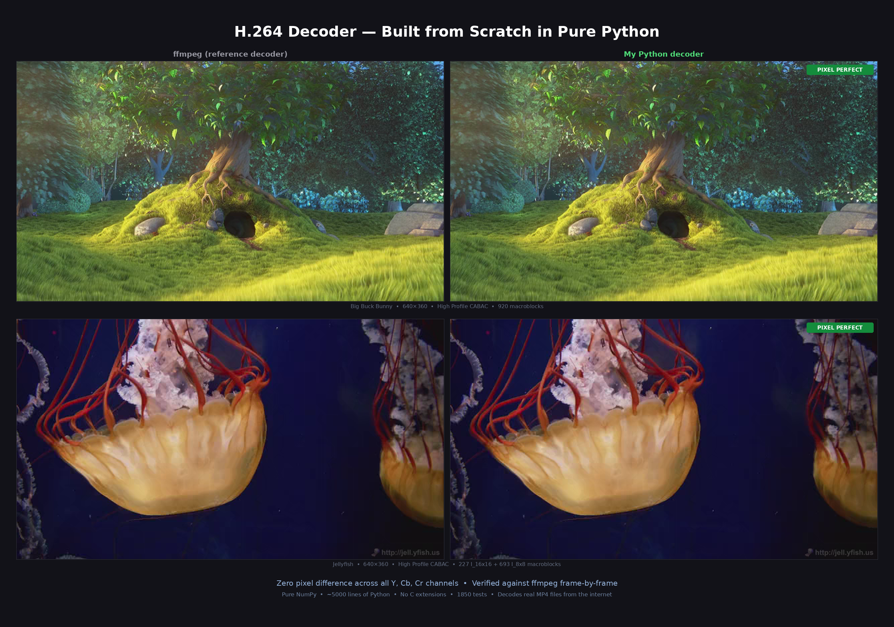
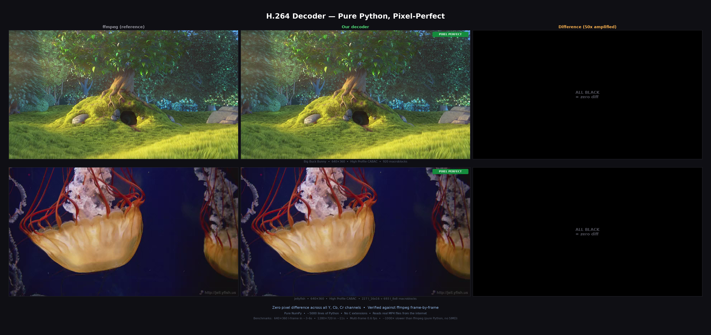
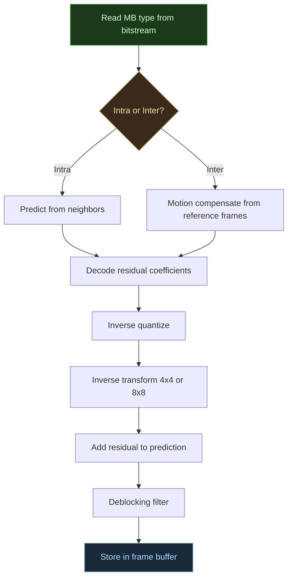
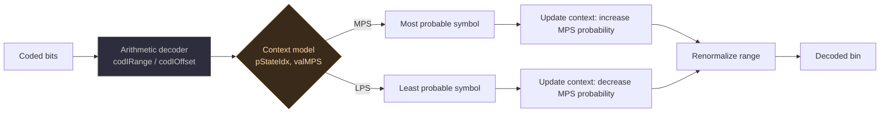
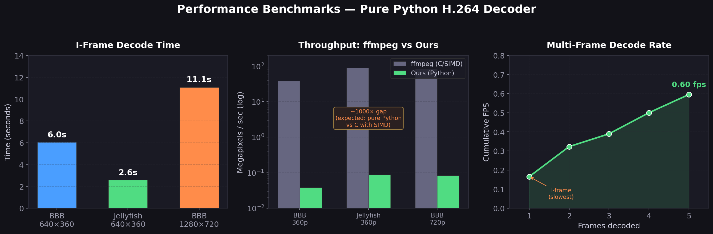

# h264-decoder

[](https://www.python.org/)
[](LICENSE)
[](#running-tests)
[](#supported-features)

A pixel-perfect H.264 video decoder written from scratch in pure Python and NumPy.

Decodes real MP4 files downloaded from the internet — no C extensions, no FFI, no dependencies on existing codec libraries. Built to understand how video compression actually works.



<details>
<summary>With pixel diff visualization (click to expand)</summary>



</details>

## What it does

```python
from decoder.decoder import H264Decoder

decoder = H264Decoder()

# Decode an MP4 from the internet
for frame in decoder.decode_file("big_buck_bunny.mp4"):
    print(f"{frame.width}x{frame.height}")
    y, cb, cr = frame.luma, frame.cb, frame.cr  # YUV 4:2:0
    rgb = frame.to_rgb()                         # or RGB
```

## Pixel-perfect accuracy

Verified against ffmpeg on real internet videos — zero pixel difference across Y, Cb, and Cr channels:

| Video | Resolution | Max pixel diff |
|-------|-----------|---------------|
| Big Buck Bunny | 640x360 | **0** |
| Big Buck Bunny | 1280x720 | **0** |
| Jellyfish | 640x360 | **0** |
| Sintel | 640x360 | **0** |

## Supported features

| Feature | Status |
|---------|--------|
| **Profiles** | Baseline, Main, High |
| **Entropy coding** | CAVLC, CABAC |
| **Frame types** | I, P, B |
| **Intra prediction** | 4x4 (9 modes), 8x8 (9 modes), 16x16 (4 modes) |
| **Inter prediction** | All partition sizes, sub-pixel interpolation, weighted prediction |
| **Transforms** | 4x4 IDCT, 8x8 IDCT, Hadamard |
| **Deblocking filter** | Full implementation |
| **Container** | Raw H.264 (Annex B), MP4 |
| **Reference management** | DPB, MMCO, reference list reordering |

## Decoding pipeline

Each module maps to a stage of the H.264 spec:

```mermaid
flowchart LR
    A["MP4 / Annex B
    container/"] --> B["NAL Parser
    bitstream/"]
    B --> C["SPS / PPS
    parameters/"]
    C --> D["Slice Header
    slice/"]
    D --> E["Entropy Decode
    entropy/"]
    E --> F["Dequantize
    dequant/"]
    F --> G["Inverse Transform
    transform/"]
    G --> H["Prediction
    intra/ inter/"]
    H --> I["Reconstruct
    reconstruct/"]
    I --> J["Deblock
    deblock/"]
    J --> K["Output
    color/"]

    style A fill:#2d2d3d,stroke:#555,color:#ccc
    style B fill:#2d2d3d,stroke:#555,color:#ccc
    style C fill:#2d2d3d,stroke:#555,color:#ccc
    style D fill:#2d2d3d,stroke:#555,color:#ccc
    style E fill:#2d2d3d,stroke:#555,color:#ccc
    style F fill:#2d2d3d,stroke:#555,color:#ccc
    style G fill:#2d2d3d,stroke:#555,color:#ccc
    style H fill:#2d2d3d,stroke:#555,color:#ccc
    style I fill:#2d2d3d,stroke:#555,color:#ccc
    style J fill:#2d2d3d,stroke:#555,color:#ccc
    style K fill:#2d2d3d,stroke:#555,color:#ccc
```



### How a macroblock is decoded



### CABAC binary arithmetic decoding



## Project structure

```
h264-decoder/
├── bitstream/       # NAL unit parsing, bit-level I/O
├── parameters/      # SPS/PPS parsing
├── slice/           # Slice header, weight tables
├── entropy/         # CAVLC and CABAC decoding
├── dequant/         # Inverse quantization, scaling lists
├── transform/       # 4x4 and 8x8 IDCT, Hadamard
├── intra/           # Intra prediction (4x4, 8x8, 16x16)
├── inter/           # Inter prediction, motion compensation
├── deblock/         # Deblocking filter
├── reconstruct/     # Macroblock reconstruction
├── color/           # YCbCr to RGB conversion
├── container/       # MP4 demuxer
├── decoder/         # Main decoder orchestration
├── test_data/       # Test streams (not tracked, see below)
└── docs/            # Architecture docs, spec mapping
```

## Setup

```bash
git clone https://github.com/abhiksark/h264-decoder.git
cd h264-decoder
pip install -r requirements.txt
```

## Running tests

```bash
# Full test suite (1850 tests)
pytest -v

# Specific module
pytest decoder/tests/ -v
pytest entropy/tests/ -v

# High Profile pixel-perfect tests (requires test videos)
pytest decoder/tests/test_high_profile.py -v
```

### Test data

Binary test files (`.264`, `.yuv`, `.mp4`) are not tracked in git. To run the full test suite including pixel-perfect comparisons:

```bash
# Download test videos
wget "https://test-videos.co.uk/vids/bigbuckbunny/mp4/h264/360/Big_Buck_Bunny_360_10s_1MB.mp4" \
  -O test_data/bbb_360_10s.mp4
wget "https://test-videos.co.uk/vids/jellyfish/mp4/h264/360/Jellyfish_360_10s_1MB.mp4" \
  -O test_data/jellyfish_360_10s.mp4

# Generate ffmpeg reference output
ffmpeg -skip_loop_filter all -i test_data/bbb_360_10s.mp4 \
  -vframes 1 -f rawvideo -pix_fmt yuv420p test_data/bbb_frame1_ref.yuv
ffmpeg -skip_loop_filter all -i test_data/jellyfish_360_10s.mp4 \
  -vframes 1 -f rawvideo -pix_fmt yuv420p test_data/jellyfish_360_10s_ref.yuv
```

## How it works

This decoder implements every stage of H.264 decoding from the spec (ITU-T H.264 / ISO 14496-10):

- **Entropy decoding**: Both CAVLC (variable-length codes) and CABAC (context-adaptive binary arithmetic coding) with full context modeling
- **Inverse quantization**: Position-dependent scaling with 8x8 scaling list support for High Profile
- **Inverse transform**: Integer 4x4 and 8x8 butterfly transforms matching the JM reference decoder exactly
- **Intra prediction**: All 9 modes for 4x4 and 8x8 blocks with lowpass reference sample filtering
- **Inter prediction**: Motion compensation with quarter-pixel interpolation, B-frame bi-prediction, weighted prediction, and direct mode
- **Deblocking filter**: Boundary strength calculation and adaptive filtering

## Performance

This is an educational decoder — correctness over speed. Pure Python with NumPy, no SIMD, no threading.



| Input | Resolution | I-frame decode | Throughput |
|-------|-----------|---------------|------------|
| Big Buck Bunny | 640x360 | ~6s | 0.04 Mpx/s |
| Jellyfish | 640x360 | ~2.5s | 0.09 Mpx/s |
| Big Buck Bunny | 1280x720 | ~11s | 0.08 Mpx/s |

Multi-frame decoding (P/B-frames): ~0.6 fps at 640x360.

For comparison, ffmpeg decodes the same content at ~1000x the speed. The goal here isn't performance — it's a readable, spec-compliant implementation you can step through with a debugger.

## Dependencies

- `numpy` — array operations
- `pytest` — testing (dev only)
- `pillow` — image output (optional)

## References

- [ITU-T H.264](https://www.itu.int/rec/T-REC-H.264) — the spec
- [JM Reference Software](https://github.com/shihuade/JM) — reference encoder/decoder used for verification

## License

Apache License 2.0 — see [LICENSE](LICENSE).
