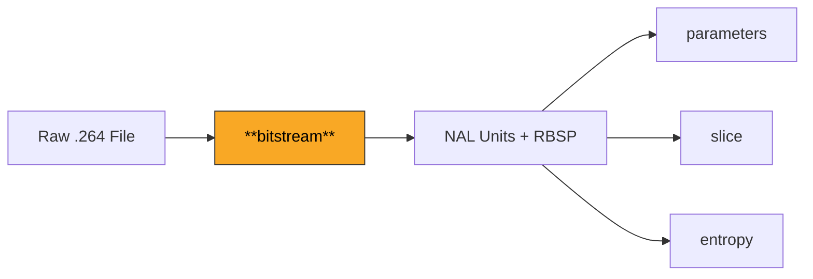
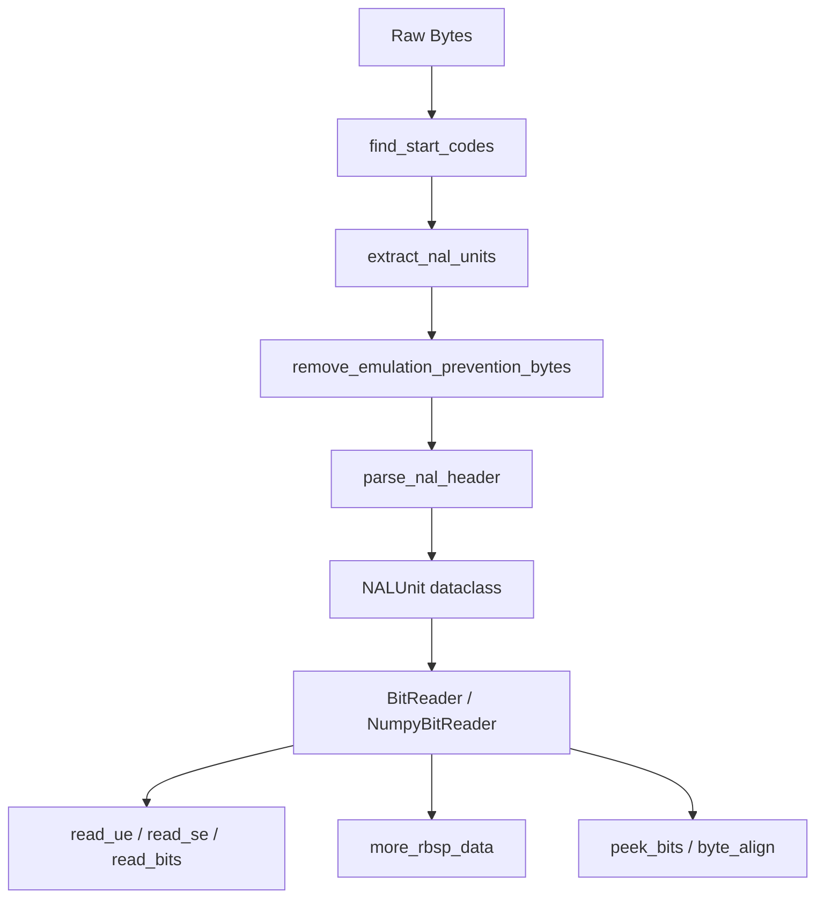

# Bitstream

The entry point of the H.264 decoding pipeline. This module handles parsing raw Annex B byte streams into NAL (Network Abstraction Layer) units and provides bit-level reading of Exp-Golomb coded syntax elements.

**H.264 Spec Reference:** Section 7.3.1 (NAL unit syntax), Section 9.1 (Exp-Golomb coding), Annex B (Byte stream format)

## What It Does

An H.264 bitstream is a sequence of NAL units separated by start codes (`0x000001` or `0x00000001`). Each NAL unit carries a specific type of data -- parameter sets, slice headers, or coded pixel data. Before any decoding can happen, the raw byte stream must be segmented into these NAL units and their emulation prevention bytes removed to recover the Raw Byte Sequence Payload (RBSP).

Once RBSP bytes are extracted, individual syntax elements must be read at the bit level. H.264 uses Exponential-Golomb (Exp-Golomb) variable-length coding for most syntax elements. The `BitReader` class provides methods for reading unsigned (`ue(v)`), signed (`se(v)`), and truncated (`te(v)`) Exp-Golomb codes, as well as fixed-length bit fields and flags.

The module provides two `BitReader` implementations: a pure NumPy reader (`NumpyBitReader`) with no external dependencies, and a legacy `bitstring`-based reader. Both expose an identical interface for downstream consumers.

## Pipeline Position



## Architecture



## Key Files

| File | Lines | Description |
|------|-------|-------------|
| `nal_parser.py` | 390 | NAL unit extraction from Annex B streams: start code detection, emulation prevention byte removal, `NALUnit` dataclass |
| `numpy_bit_reader.py` | 443 | Pure NumPy bit-level reader with Exp-Golomb decoding, no external dependencies |
| `bit_reader.py` | 432 | Wrapper providing `BitReader`/`BitWriter` classes, factory function for choosing implementation |

## Key Concepts

**Start Codes.** NAL units in Annex B format are delimited by byte patterns `0x000001` (3-byte) or `0x00000001` (4-byte). The `find_start_codes()` function scans for these patterns to segment the stream.

**Emulation Prevention.** Inside NAL unit data, the byte sequence `0x000003` is an escape that prevents accidental start code patterns. The `0x03` byte must be stripped to recover the true RBSP. For example, `0x00 0x00 0x03 0x01` in the stream represents `0x00 0x00 0x01` in the payload.

**Exp-Golomb Coding.** The primary variable-length code in H.264. A `ue(v)` value is encoded as N leading zero bits, a `1` bit, then N suffix bits. The decoded value is `(1 << N) - 1 + suffix`. Signed values (`se(v)`) map unsigned codes to signed via `(-1)^(k+1) * ceil(k/2)`.

**NAL Unit Types.** Each NAL has a 5-bit type field (Table 7-1): type 7 = SPS, type 8 = PPS, type 5 = IDR slice, type 1 = non-IDR slice, type 6 = SEI. The `NALUnitType` enum provides named constants.

**RBSP Trailing Bits.** The `more_rbsp_data()` method detects the end of meaningful data by checking for the `rbsp_stop_one_bit` pattern (a `1` followed by zeros to the byte boundary).

## Example

```python
from bitstream import extract_nal_units, BitReader, NALUnitType

# Extract NAL units from an Annex B file
with open("video.264", "rb") as f:
    data = f.read()
nals = extract_nal_units(data)

for nal in nals:
    if nal.nal_unit_type == NALUnitType.SPS:
        reader = BitReader(nal.rbsp)
        profile_idc = reader.read_bits(8)
        print(f"Profile: {profile_idc}")
    elif nal.nal_unit_type == NALUnitType.SLICE_IDR:
        reader = BitReader(nal.rbsp)
        first_mb = reader.read_ue()
        slice_type = reader.read_ue()
        print(f"IDR slice: first_mb={first_mb}, type={slice_type}")
```

## Spec Compliance Notes

- The `more_rbsp_data()` implementation checks for the RBSP stop bit pattern (Section 7.2) rather than simply checking `bits_remaining > 0`, which is critical for correctly terminating slice parsing in small NAL units.
- Emulation prevention removal handles all four escaped sequences (`0x00000300` through `0x00000303`) per Section 7.4.1.
- Exp-Golomb decoding enforces a 32-bit ceiling on leading zeros to prevent infinite loops on corrupted streams, which the spec does not explicitly mandate but practical decoders require.
