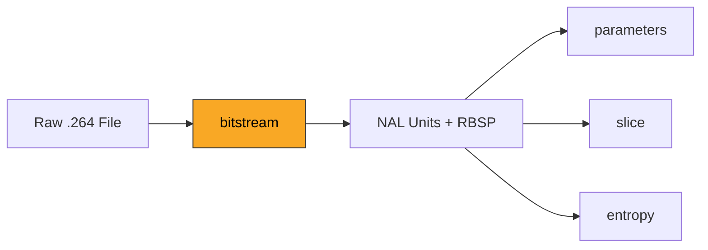
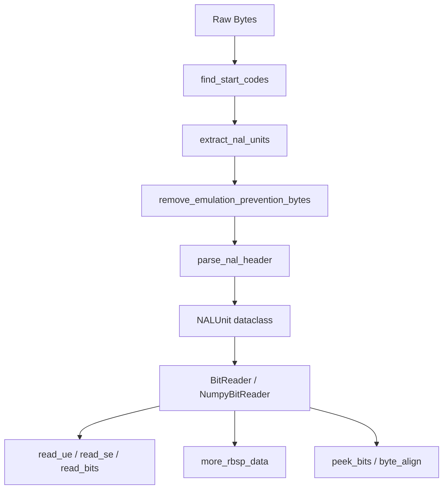

# Bitstream

The entry point of the H.264 decoding pipeline. This module segments raw Annex B
byte streams into NAL (Network Abstraction Layer) units, strips emulation
prevention bytes, and provides bit-level reading of Exp-Golomb coded syntax
elements.

**H.264 Spec Reference:** Section 7.3.1 (NAL unit syntax), Section 9.1
(Exp-Golomb coding), Annex B (Byte stream format)

## Pipeline Position



## NAL Unit Structure

An H.264 file is a sequence of NAL units separated by start codes. Each NAL
unit carries one payload: a parameter set, a slice header, coded pixel data,
or metadata. The byte layout of one NAL unit in Annex B format:

```
 Annex B NAL Unit
 +-----------+--------+------------------------------+
 | Start Code| Header |     EBSP Payload ...         |
 | 00 00 01  | 1 byte |     variable length           |
 | (3 bytes) |        |                              |
 +-----------+--------+------------------------------+
              |
              v
  +---+----------+-----------+
  | F | NRI (2b) | Type (5b) |  <-- NAL header byte
  +---+----------+-----------+
  bit 7   6..5      4..0

  F   = forbidden_zero_bit (must be 0)
  NRI = nal_ref_idc (0-3, higher = more important for reference)
  Type = nal_unit_type (see table below)
```

**NAL Unit Types (Table 7-1):**

| Type | Name           | Description                     |
|------|----------------|---------------------------------|
| 1    | SLICE_NON_IDR  | Coded slice of a non-IDR frame  |
| 5    | SLICE_IDR      | Coded slice of an IDR frame     |
| 6    | SEI            | Supplemental enhancement info   |
| 7    | SPS            | Sequence Parameter Set          |
| 8    | PPS            | Picture Parameter Set           |
| 9    | AUD            | Access Unit Delimiter           |

### Concrete Example: SPS NAL Unit

A real SPS NAL unit for a 352x288 Baseline stream at Level 1.3:

```
Hex:  00 00 00 01  67  42 C0 0D  DA 0F 0A 69  A8
      ----------- --- --------   ----------------
      start code  hdr     EBSP payload (SPS data)

Header byte 0x67:
  forbidden = 0
  nal_ref_idc = 3   (high importance -- parameter sets always 3)
  nal_unit_type = 7  (SPS)

RBSP bytes after emulation prevention removal:
  42 C0 0D DA 0F 0A 69 A8
  |  |  |
  |  |  +-- level_idc = 13 (Level 1.3)
  |  +-- constraint flags + reserved
  +-- profile_idc = 66 (Baseline)
```

## Emulation Prevention Bytes

NAL unit payloads must never contain the byte sequence `00 00 01` (which would
look like a start code). The encoder inserts `03` as an escape byte:

```
 RBSP (what the decoder sees)    EBSP (what is on the wire)
 ----------------------------    ---------------------------
 00 00 00                   -->  00 00 03 00
 00 00 01                   -->  00 00 03 01
 00 00 02                   -->  00 00 03 02
 00 00 03                   -->  00 00 03 03
```

The `remove_emulation_prevention_bytes()` function reverses this: it scans for
`00 00 03` and strips the `03` byte to recover the true RBSP.

## Exp-Golomb Coding

H.264 uses Exponential-Golomb variable-length codes for most syntax elements.
A `ue(v)` codeword has three parts:

```
  [N zeros] [1] [N suffix bits]
  <--prefix-->   <---suffix--->

  Decoded value = (1 << N) - 1 + suffix
```

The first few codewords:

```
  Bits        N   Suffix   Value
  ---------   --  ------   -----
  1            0   --        0
  010          1   0         1
  011          1   1         2
  00100        2   00        3
  00101        2   01        4
  00110        2   10        5
  00111        2   11        6
  0001000      3   000       7
```

**Signed Exp-Golomb** `se(v)` maps unsigned codes to signed values using the
interleaving `0, +1, -1, +2, -2, ...`:

```
  ue(v)  -->  se(v)
    0          0
    1         +1
    2         -1
    3         +2
    4         -2
    5         +3
```

Formula: `se = (-1)^(k+1) * ceil(k/2)` where `k = ue(v)`.

## Architecture



## Key Files

| File | Description |
|------|-------------|
| `nal_parser.py` | NAL unit extraction from Annex B streams: start code detection, emulation prevention byte removal, `NALUnit` dataclass |
| `numpy_bit_reader.py` | Pure NumPy bit-level reader with Exp-Golomb decoding, no external dependencies |
| `bit_reader.py` | Wrapper providing `BitReader`/`BitWriter` classes, factory function for choosing implementation |

## API Reference

```python
# --- NAL parsing ---
extract_nal_units(bitstream: bytes) -> List[NALUnit]
iter_nal_units(bitstream: bytes) -> Iterator[NALUnit]   # memory-efficient
parse_nal_header(header_byte: int) -> Tuple[int, int, int]
remove_emulation_prevention_bytes(data: bytes) -> bytes

# --- Bit reading ---
reader = BitReader(rbsp_bytes)
reader.read_bits(n)    # unsigned int from n bits
reader.read_ue()       # unsigned Exp-Golomb
reader.read_se()       # signed Exp-Golomb
reader.read_te(max)    # truncated Exp-Golomb
reader.read_flag()     # single bit as bool
reader.peek_bits(n)    # look ahead without consuming
reader.byte_align()    # skip to next byte boundary
reader.more_rbsp_data()  # check for RBSP trailing bits
```

## Usage Example

```python
from bitstream import extract_nal_units, BitReader, NALUnitType

with open("video.264", "rb") as f:
    data = f.read()
nals = extract_nal_units(data)

for nal in nals:
    if nal.nal_unit_type == NALUnitType.SPS:
        reader = BitReader(nal.rbsp)
        profile_idc = reader.read_bits(8)
        print(f"Profile: {profile_idc}")
    elif nal.nal_unit_type == NALUnitType.SLICE_IDR:
        reader = BitReader(nal.rbsp)
        first_mb = reader.read_ue()
        slice_type = reader.read_ue()
        print(f"IDR slice: first_mb={first_mb}, type={slice_type}")
```

## Spec Compliance Notes

- `more_rbsp_data()` checks for the RBSP stop bit pattern (Section 7.2) rather
  than simply checking `bits_remaining > 0`, which is critical for correctly
  terminating slice parsing in small NAL units.
- Emulation prevention removal handles all four escaped sequences
  (`0x00000300` through `0x00000303`) per Section 7.4.1.
- Exp-Golomb decoding enforces a 32-bit ceiling on leading zeros to prevent
  infinite loops on corrupted streams.
