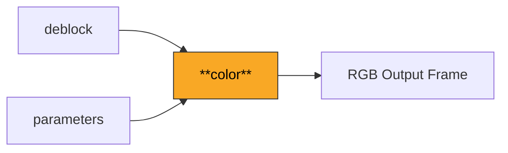
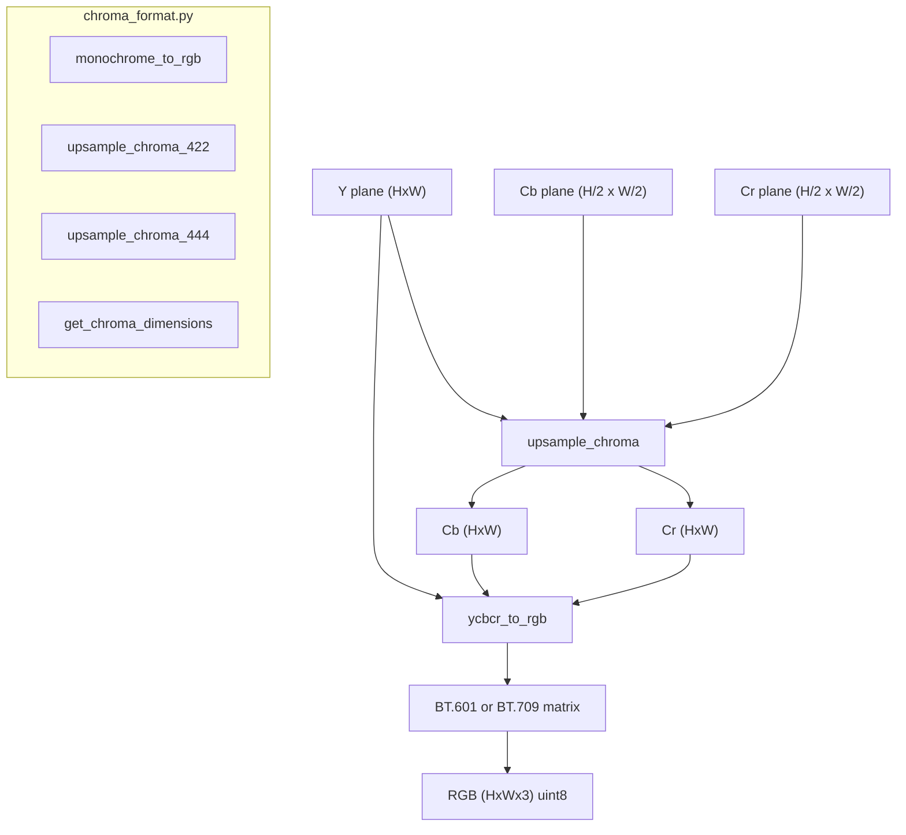

# Color

Handles YCbCr to RGB color space conversion and chroma upsampling for all supported chroma formats (4:2:0, 4:2:2, 4:4:4, and monochrome). Supports BT.601 (SD) and BT.709 (HD) color matrices.

**H.264 Spec Reference:** Annex E (Video Usability Information), E.2.1 (Color space definitions)

## What It Does

H.264 internally uses the YCbCr color space, where Y is the luma (brightness) component and Cb/Cr are the chroma (color difference) components. Most display systems expect RGB, so the final step of the decoding pipeline converts the reconstructed YCbCr planes to RGB.

In 4:2:0 chroma format (the most common), Cb and Cr planes have half the width and half the height of the luma plane. Before color conversion, these must be upsampled back to full resolution. The module provides simple nearest-neighbor replication for this step. For 4:2:2, only horizontal upsampling is needed. For 4:4:4, all planes are already at full resolution.

The color conversion applies a matrix transform that depends on the video standard. BT.601 is used for standard definition (480i/576i), while BT.709 is used for HD (720p and above). The VUI parameters in the SPS can signal which matrix to use via `matrix_coefficients`. Monochrome video (chroma_format_idc=0) simply replicates the luma channel to all three RGB channels.

## Pipeline Position



## Architecture



## Key Files

| File | Lines | Description |
|------|-------|-------------|
| `yuv_to_rgb.py` | 269 | Core conversion: `ycbcr_to_rgb`, chroma upsampling (4:2:0 nearest-neighbor replication), BT.601/BT.709 color matrices |
| `chroma_format.py` | 114 | Chroma format utilities: `get_chroma_dimensions`, `get_subsampling_factors`, `monochrome_to_rgb`, 4:2:2/4:4:4 upsampling, separate color plane dimensions |

## Key Concepts

**BT.601 Color Matrix (SD).** Standard definition video uses these conversion coefficients:
```
R = Y + 1.402 * (Cr - 128)
G = Y - 0.344136 * (Cb - 128) - 0.714136 * (Cr - 128)
B = Y + 1.772 * (Cb - 128)
```
Derived from color primaries with Kr=0.299, Kb=0.114.

**BT.709 Color Matrix (HD).** High definition video uses:
```
R = Y + 1.5748 * (Cr - 128)
G = Y - 0.187324 * (Cb - 128) - 0.468124 * (Cr - 128)
B = Y + 1.8556 * (Cb - 128)
```
Derived from color primaries with Kr=0.2126, Kb=0.0722.

**Chroma Subsampling.** In 4:2:0 (chroma_format_idc=1), each chroma sample covers a 2x2 area of luma samples. Subsampling factors: 4:2:0=(2,2), 4:2:2=(2,1), 4:4:4=(1,1), monochrome=(0,0). The `get_subsampling_factors` function returns these as (sub_width, sub_height).

**Upsampling.** For 4:2:0, chroma is upsampled by repeating each sample to a 2x2 block (`np.repeat` along both axes). This is nearest-neighbor upsampling, which is the simplest method. More sophisticated methods (bilinear, 6-tap) could reduce chroma aliasing but are not normative in H.264.

**Clipping.** After the matrix multiply (performed in float32), results are clipped to [0, 255] and cast to uint8. The float computation avoids integer overflow that would occur with direct 8-bit arithmetic.

## Example

```python
from color import ycbcr_to_rgb, ColorMatrix
from color.chroma_format import monochrome_to_rgb, get_chroma_dimensions

# Standard 4:2:0 conversion
rgb = ycbcr_to_rgb(
    y=luma_frame,          # (288, 352) uint8
    cb=cb_frame,           # (144, 176) uint8
    cr=cr_frame,           # (144, 176) uint8
    color_matrix=ColorMatrix.BT601,
)
# rgb is (288, 352, 3) uint8

# Get chroma dimensions for a given luma size
cb_w, cb_h, cr_w, cr_h = get_chroma_dimensions(
    luma_width=1920, luma_height=1080, chroma_format_idc=1
)
# cb_w=960, cb_h=540 for 4:2:0

# Monochrome video
rgb_mono = monochrome_to_rgb(luma_frame)  # Y replicated to R, G, B
```

## Spec Compliance Notes

- The color matrix selection should ideally be driven by the `matrix_coefficients` field in the SPS VUI parameters. When VUI is absent, BT.601 is a safe default for SD content and BT.709 for HD. The module exposes both and lets the caller choose.
- Chroma upsampling for 4:2:0 uses simple pixel replication (nearest-neighbor), which is common in decoder implementations. The H.264 spec does not mandate a specific upsampling filter -- this is a display-stage decision.
- All intermediate color conversion arithmetic uses float32 to avoid overflow. The final clip to [0, 255] and cast to uint8 happens in a single vectorized NumPy operation for efficiency.
