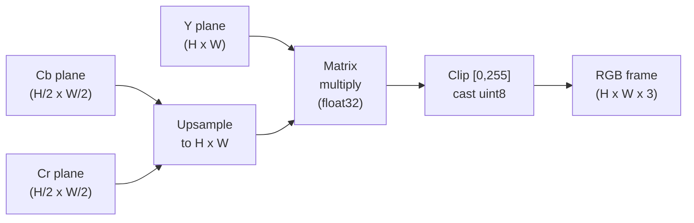
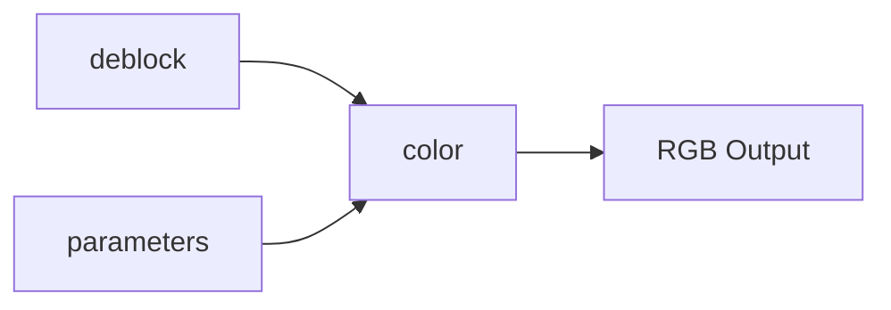

# Color

Converts decoded YCbCr frames to RGB for display. Handles chroma upsampling
for 4:2:0/4:2:2/4:4:4 formats and supports BT.601 (SD) and BT.709 (HD) color
matrices.

**H.264 Spec Reference:** Annex E (Video Usability Information), E.2.1

## YCbCr 4:2:0 Subsampling

H.264 stores video in YCbCr, where Y carries brightness and Cb/Cr carry color
difference. In 4:2:0 (the most common format), each chroma sample covers a 2x2
region of luma samples, cutting chroma data to 1/4 the luma size:

```
  Luma (Y) plane         Cb plane           Cr plane
  1920 x 1080            960 x 540          960 x 540

  +--+--+--+--+--+--+    +-----+-----+--+   +-----+-----+--+
  |  |  |  |  |  |  |    |     |     |  |   |     |     |  |
  +--+--+--+--+--+--+    |  Cb |  Cb |  |   |  Cr |  Cr |  |
  |  |  |  |  |  |  |    |     |     |  |   |     |     |  |
  +--+--+--+--+--+--+    +-----+-----+--+   +-----+-----+--+
  |  |  |  |  |  |  |    |     |     |  |   |     |     |  |
  +--+--+--+--+--+--+    +-----+-----+--+   +-----+-----+--+

  Each small square =     Each large square =
  one luma sample         one chroma sample
                          (covers 2x2 luma area)

  Total samples:          Total samples:
  1920 * 1080 = 2M        960 * 540 * 2 = 1M   (Y:Cb:Cr = 4:1:1 ratio)
```

All subsampling formats:

```
Format    Cb/Cr size     SubW  SubH   Typical use
-------   ----------     ----  ----   -----------
4:2:0     W/2 x H/2       2     2    Most H.264 video
4:2:2     W/2 x H         2     1    Professional/broadcast
4:4:4     W x H            1     1    High-end / lossless
Mono      (none)           -     -    Grayscale
```

## Chroma Upsampling

Before color conversion, chroma planes must be expanded to match luma resolution.
For 4:2:0, each chroma sample is replicated to a 2x2 block (nearest-neighbor):

```
Input Cb (2x2):        Output Cb (4x4):
+----+----+            +--+--+--+--+
| 80 |120 |    --->    |80|80|120|120|
+----+----+            |80|80|120|120|
|100 |140 |            |100|100|140|140|
+----+----+            |100|100|140|140|
                       +--+--+--+--+
```

H.264 does not mandate a specific upsampling filter; nearest-neighbor matches
most hardware decoders.

## Color Conversion Matrices

Cb and Cr are stored as unsigned [0, 255] with 128 as neutral. They are shifted
to signed before applying the matrix.

**BT.601 (SD video, Kr=0.299, Kb=0.114):**

```
R = Y                + 1.402   * (Cr - 128)
G = Y - 0.344136 * (Cb - 128) - 0.714136 * (Cr - 128)
B = Y + 1.772    * (Cb - 128)
```

**BT.709 (HD video, Kr=0.2126, Kb=0.0722):**

```
R = Y                + 1.5748  * (Cr - 128)
G = Y - 0.187324 * (Cb - 128) - 0.468124 * (Cr - 128)
B = Y + 1.8556   * (Cb - 128)
```

The SPS VUI `matrix_coefficients` field signals which matrix to use. When VUI
is absent, BT.601 is a safe default for SD and BT.709 for HD.

## Conversion Pipeline



All arithmetic uses float32 to avoid overflow; the final clip and uint8 cast
is a single vectorized NumPy operation.

## Pipeline Position



## Key Files

| File | Description |
|------|-------------|
| `yuv_to_rgb.py` | Core: `ycbcr_to_rgb`, `upsample_chroma`, `ColorMatrix` enum, BT.601/BT.709 coefficients |
| `chroma_format.py` | Utilities: `get_chroma_dimensions`, `get_subsampling_factors`, `monochrome_to_rgb`, 4:2:2/4:4:4 upsampling |

## Example

```python
from color import ycbcr_to_rgb, ColorMatrix
from color.chroma_format import get_chroma_dimensions, monochrome_to_rgb

# Standard 4:2:0 HD conversion
rgb = ycbcr_to_rgb(
    y=luma_frame,           # (1080, 1920) uint8
    cb=cb_frame,            # (540, 960) uint8
    cr=cr_frame,            # (540, 960) uint8
    color_matrix=ColorMatrix.BT709,
)
# rgb is (1080, 1920, 3) uint8

# Query chroma plane dimensions
cb_w, cb_h, cr_w, cr_h = get_chroma_dimensions(
    luma_width=1920, luma_height=1080, chroma_format_idc=1,
)
# cb_w=960, cb_h=540 for 4:2:0

# Monochrome (grayscale) video
rgb_mono = monochrome_to_rgb(luma_frame)  # Y replicated to R, G, B
```

## Spec Compliance Notes

- Color matrix selection should be driven by VUI `matrix_coefficients`. The
  module exposes both BT.601 and BT.709 and lets the caller choose.
- Chroma upsampling uses nearest-neighbor (pixel replication), not normatively
  specified by H.264.
- Monochrome (chroma_format_idc=0) replicates luma to all three RGB channels.
