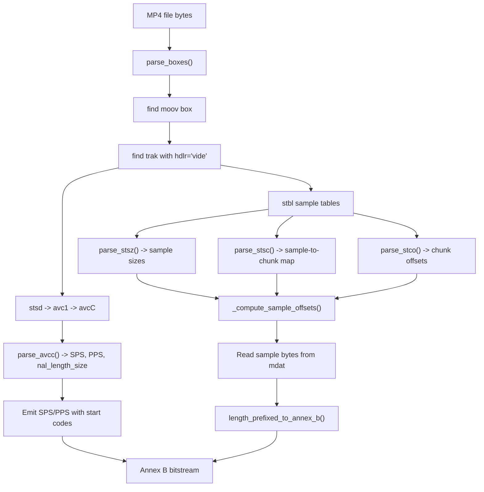

# container/

MP4 (ISO 14496-12) container demuxer. Parses the box hierarchy of MP4 files to
extract H.264 NAL units from video tracks and converts them from AVCC
(length-prefixed) format to Annex B (start-code-delimited) format for the
decoder pipeline.

**ISO 14496-12 (ISOBMFF), ISO 14496-15 (AVCC)**

## MP4 Box Hierarchy

An MP4 file is a tree of nested boxes (also called atoms). Each box has a
4-byte size, a 4-char type code, and payload data. Container boxes hold
children; leaf boxes hold raw data. Here is the hierarchy this parser
traverses for a typical H.264 video:

```
MP4 File
+-- ftyp              File type and compatibility
+-- moov              Movie metadata (container)
|   +-- mvhd          Movie header (timescale, duration)
|   +-- trak          Track (container) -------- one per stream
|   |   +-- tkhd      Track header
|   |   +-- mdia      Media information (container)
|   |   |   +-- mdhd  Media header (timescale)
|   |   |   +-- hdlr  Handler: "vide" = video track  <--- track selection
|   |   |   +-- minf  Media info (container)
|   |   |       +-- stbl  Sample table (container)
|   |   |           +-- stsd  Sample description
|   |   |           |   +-- avc1  H.264 sample entry
|   |   |           |       +-- avcC  SPS + PPS + NAL length size
|   |   |           +-- stsz  Sample sizes  (bytes per frame)
|   |   |           +-- stsc  Sample-to-chunk mapping
|   |   |           +-- stco  Chunk offsets (32-bit)
|   |   |           +-- co64  Chunk offsets (64-bit, large files)
|   +-- trak          (audio track, subtitles, etc.)
+-- mdat              Media data (raw frame bytes live here)
```

## The avcC Box

In Annex B streams, SPS and PPS are inline NAL units with start codes. In MP4,
they are stored out-of-band in the `avcC` (AVC Decoder Configuration Record)
box inside the sample description:

```
avcC layout (ISO 14496-15 Section 5.2.4.1)
+--------+---------------------------------------------+
| Byte 0 | configurationVersion = 1                    |
| Byte 1 | AVCProfileIndication (e.g. 66=Baseline)     |
| Byte 2 | profile_compatibility                       |
| Byte 3 | AVCLevelIndication (e.g. 30 = Level 3.0)    |
| Byte 4 | xxxxxx11 --> nal_length_size = (low 2 bits)+1|
| Byte 5 | xxx00001 --> numOfSPS = low 5 bits          |
| Bytes.. | [sps_length (2B), sps_nal_unit (N B)] x num |
| Next   | numOfPPS                                     |
| Bytes.. | [pps_length (2B), pps_nal_unit (N B)] x num |
+--------+---------------------------------------------+
```

The `nal_length_size` (typically 4) tells the parser how many bytes prefix each
NAL unit in the sample data. This is critical -- some encoders use 1 or 2 byte
lengths instead of 4.

## AVCC vs Annex B: NAL Unit Format

```
AVCC (MP4 samples):                  Annex B (raw .264 streams):
+--------+------------------+       +--+--+--+--+------------------+
| LEN(4) | NAL unit bytes   |       | 00 00 00 01 | NAL unit bytes |
+--------+------------------+       +--+--+--+--+------------------+
Length prefix (big-endian)           Start code (0x00000001)
```

The conversion replaces each length prefix with the 4-byte start code.

## Pipeline Position


## Data Flow



## Key Files

| File | Lines | Description |
|------|-------|-------------|
| `mp4.py` | 529 | Complete MP4 parser: `Box` dataclass, recursive box parsing, `avcC` extraction, sample table processing, AVCC-to-Annex-B conversion |

## API Reference

| Function | Purpose |
|----------|---------|
| `extract_h264_from_mp4(mp4_data)` | Top-level entry: returns Annex B bytes from complete MP4 |
| `parse_boxes(data)` | Parse all top-level boxes in a byte buffer |
| `parse_box(data, offset)` | Parse a single box at a given offset |
| `find_box(boxes, type)` | Find first box of a given type in a list |
| `find_box_recursive(boxes, type)` | Depth-first recursive box search |
| `parse_avcc(data)` | Parse AVC Decoder Configuration Record |
| `length_prefixed_to_annex_b(data, nal_length_size)` | Convert length-prefixed NALs to Annex B |
| `parse_stsz(data)` | Parse sample size table |
| `parse_stsc(data)` | Parse sample-to-chunk table |
| `parse_stco(data)` / `parse_co64(data)` | Parse chunk offset tables (32/64-bit) |

## Example

```python
from container.mp4 import extract_h264_from_mp4

with open("video.mp4", "rb") as f:
    mp4_data = f.read()

# Parse MP4 boxes, extract SPS/PPS from avcC, convert all samples to Annex B
annexb_stream = extract_h264_from_mp4(mp4_data)

# Now decode with the standard pipeline
from bitstream import extract_nal_units
nals = extract_nal_units(annexb_stream)
```

## Spec Compliance Notes

- `avcC` version 1 with variable NAL length sizes (1, 2, or 4 bytes).
- Extended 64-bit box sizes for files larger than 4 GB.
- Both `stco` (32-bit) and `co64` (64-bit) chunk offset tables.
