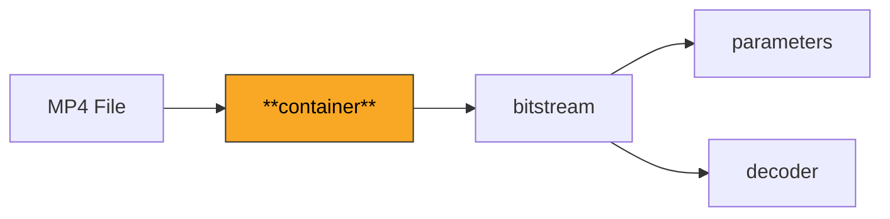
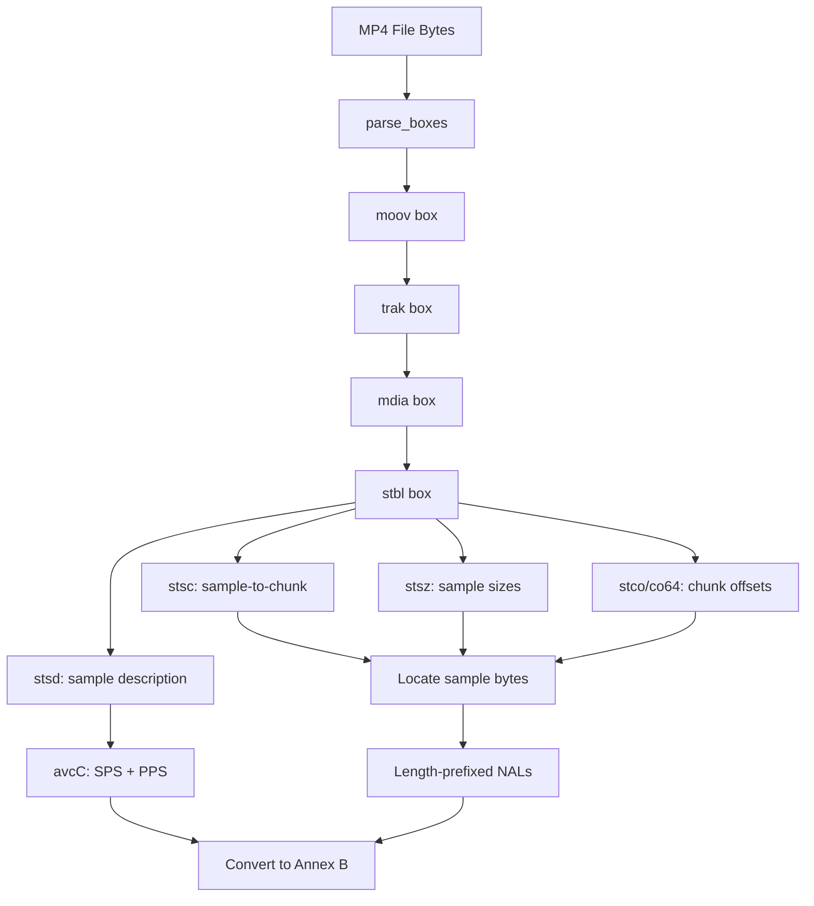

# Container

Parses MP4 (ISO 14496-12) container files to extract H.264 NAL units from video tracks. Converts from AVCC (length-prefixed) format to Annex B (start-code-delimited) format for the decoder pipeline.

**ISO 14496-12 (ISOBMFF), ISO 14496-15 (AVCC)**

## What It Does

Real-world H.264 video is almost never distributed as raw Annex B bitstreams. Instead, it is packaged inside container formats like MP4 (MPEG-4 Part 12), MKV, or AVI. The MP4 container wraps H.264 NAL units in a box-based structure where SPS and PPS are stored in a special `avcC` (AVC Configuration) box, and each video sample contains length-prefixed NAL units rather than start-code-delimited ones.

This module parses the MP4 box hierarchy to locate the video track, extract the AVC decoder configuration (SPS/PPS from `avcC`), read the sample table (`stbl`) to find each frame's byte range and timing, and convert the length-prefixed NAL units to Annex B format by replacing the length prefix with `0x00000001` start codes. The result is a standard Annex B bitstream that the rest of the decoder pipeline can process.

The parser handles both 32-bit and 64-bit box sizes, navigates container boxes (moov, trak, mdia, minf, stbl), and processes the sample-to-chunk (`stsc`), sample size (`stsz`), and chunk offset (`stco`/`co64`) tables to locate each sample's raw bytes in the file.

## Pipeline Position



## Architecture



## Key Files

| File | Lines | Description |
|------|-------|-------------|
| `mp4.py` | 529 | Complete MP4 parser: `Box` dataclass, recursive box parsing, `avcC` configuration extraction, sample table processing, AVCC-to-Annex-B conversion |

## Key Concepts

**Box Structure.** MP4 files are organized as a hierarchy of boxes (also called atoms). Each box has a 4-byte size, 4-byte type identifier (e.g., `moov`, `trak`, `stbl`), and payload data. Container boxes (like `moov` and `trak`) contain child boxes. The parser recursively descends into known container types.

**avcC Configuration.** The AVC Decoder Configuration Record contains the NAL unit length size (minus 1), SPS NAL unit(s), and PPS NAL unit(s). These parameter sets are not embedded in the sample data -- they must be extracted from `avcC` and prepended to the bitstream. The `nal_length_size` (typically 4 bytes) tells the parser how many bytes prefix each NAL unit in sample data.

**Sample Table.** Three interconnected tables locate each video frame:
- `stsz` lists the byte size of each sample
- `stsc` maps sample ranges to chunks (contiguous groups)
- `stco` (or `co64` for large files) gives the file offset of each chunk

Together, these allow computing the exact byte range for any sample.

**AVCC to Annex B.** In the container, each NAL unit is prefixed by its byte length (typically 4 bytes, big-endian). The conversion replaces each length prefix with the standard 4-byte start code `0x00000001`, producing an Annex B stream that `extract_nal_units` can parse.

**Track Selection.** An MP4 file can contain multiple tracks (video, audio, subtitles). The video track is identified by the `hdlr` box with handler type `vide`, or by the presence of `avc1`/`avc3` codec entries in the sample description.

## Example

```python
from container.mp4 import parse_mp4, extract_annexb_stream

with open("video.mp4", "rb") as f:
    mp4_data = f.read()

# Parse the MP4 and extract Annex B bitstream
annexb_stream = extract_annexb_stream(mp4_data)

# Now decode with the standard pipeline
from bitstream import extract_nal_units
nals = extract_nal_units(annexb_stream)
```

## Spec Compliance Notes

- The `avcC` box version 1 is supported, which covers the vast majority of H.264 MP4 files. The NAL unit length field size is read from `avcC` (typically 4 bytes) rather than hardcoded, as some encoders use 1 or 2 byte lengths.
- Extended box sizes (64-bit) are handled for files larger than 4 GB, where the initial 32-bit size field is set to 1 and the actual size follows in the next 8 bytes. Box size 0 indicates the box extends to the end of the file.
- The parser handles both `stco` (32-bit offsets) and `co64` (64-bit offsets) chunk offset tables, which is necessary for large files where chunk offsets exceed 4 GB.
