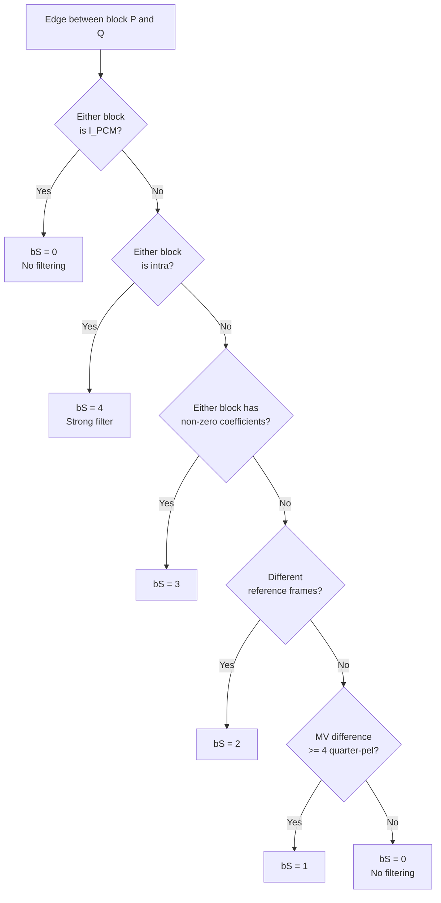
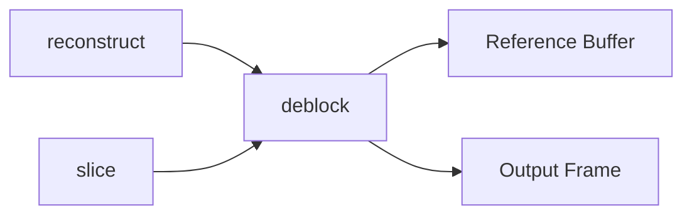

# Deblock

In-loop deblocking filter that smooths block boundary artifacts after reconstruction.
Because its output feeds back into the reference picture buffer, every decoder must
produce bit-exact results.

**H.264 Spec Reference:** Section 8.7

## Why Deblocking?

Block-based coding quantizes each 4x4/8x8 block independently. Neighboring blocks
decoded at different QPs or with different prediction modes create visible
discontinuities. The deblocking filter detects these artificial edges and smooths
them while preserving real image detail.

## Edge Processing Order

Within each macroblock, **all vertical edges** are filtered first (left to right),
then **all horizontal edges** (top to bottom). The vertical pass modifies pixels
that the horizontal pass then reads, so order matters for bit-exactness.

```
  Vertical edges (filtered first)       Horizontal edges (filtered second)
  col: 0    4    8   12                  row 0:  ---- ---- ---- ----
       |    |    |    |                  row 4:  ---- ---- ---- ----
       |    |    |    |                  row 8:  ---- ---- ---- ----
       |    |    |    |                  row 12: ---- ---- ---- ----
       |    |    |    |
```

Each edge is divided into four 4-pixel segments. For each segment, a boundary
strength (bS) is computed from the adjacent blocks.

## Boundary Strength Decision Tree



## Filter Region: p and q Samples

For each 4-pixel edge segment, the filter reads up to 4 samples on each side:

```
  Strong filter (bS=4) touches:     Normal filter (bS=1-3) touches:

  p3 p2 p1 p0 | q0 q1 q2 q3        __ __ p1 p0 | q0 q1 __ __
       *  *  * | *  *  *                    ?  * | *  ?
                                     (* = always modified, ? = conditional)
```

## Alpha/Beta Threshold Gate

Before any filtering, three conditions must all pass. This preserves real edges
in the image content -- a true object boundary will fail these checks and remain
sharp.

```
|p0 - q0| < alpha(indexA)      -- samples across edge are close
|p1 - p0| < beta(indexB)       -- p side is smooth
|q1 - q0| < beta(indexB)       -- q side is smooth

indexA = Clip3(0, 51, QP + slice_alpha_c0_offset)
indexB = Clip3(0, 51, QP + slice_beta_c0_offset)
```

Alpha and beta grow with QP. At low QP (high quality) they are near zero, so
almost no filtering occurs. At high QP (heavy compression) they permit aggressive
smoothing.

## Filter Formulas

**Normal filter (bS 1-3):** Adjusts p0 and q0 toward each other, clipped by tc0:

```
tc  = tc0_table[indexA][bS-1] + (|p2-p0| < beta) + (|q2-q0| < beta)
delta = Clip3(-tc, tc, ((q0 - p0)*4 + (p1 - q1) + 4) >> 3)
p0' = Clip1(p0 + delta)
q0' = Clip1(q0 - delta)
```

**Strong filter (bS=4):** Multi-tap filter modifying up to 3 pixels per side:

```
p0' = (p2 + 2*p1 + 2*p0 + 2*q0 + q1 + 4) >> 3
p1' = (p2 + p1 + p0 + q0 + 2) >> 2
p2' = (2*p3 + 3*p2 + p1 + p0 + q0 + 4) >> 3
```

**Chroma** uses the same bS values but its own QP (from the QPC table) and only
modifies p0 and q0. Chroma edges occur at half the spatial frequency of luma.

## Pipeline Position



## Key Files

| File | Description |
|------|-------------|
| `deblock.py` | Orchestration: `deblock_macroblock`, edge ordering, luma/chroma loops |
| `boundary.py` | `calc_boundary_strength` -- bS 0-4 from block properties |
| `filter.py` | Sample-level ops: `should_filter_edge`, strong/normal/chroma filters |
| `thresholds.py` | Spec tables: `ALPHA_TABLE`, `BETA_TABLE`, `TC0_TABLE`, `QPC_TABLE` |

## Example

```python
from deblock.boundary import calc_boundary_strength
from deblock.thresholds import get_alpha, get_beta

bs = calc_boundary_strength(
    is_intra_p=False, is_intra_q=True,
    has_coeff_p=False, has_coeff_q=True,
    mv_p=(4, 0), mv_q=(0, 0), ref_p=0, ref_q=0,
)
# bs = 4 (q is intra)

alpha = get_alpha(28)  # 20 at QP=28
beta = get_beta(28)    # 7 at QP=28
```

## Spec Compliance Notes

- For B-frames with L1-only prediction, bS must compare L1 ref/MV, not L0.
- CABAC intra MBs in P/B-slices must store canonical intra mb_type (0-25), not
  the raw CABAC mb_type with P/B offsets. The filter's `_is_intra()` check only
  recognizes types 0-25.
- Vertical edges are filtered before horizontal edges within each macroblock
  (Section 8.7). Reversing the order produces different output.
