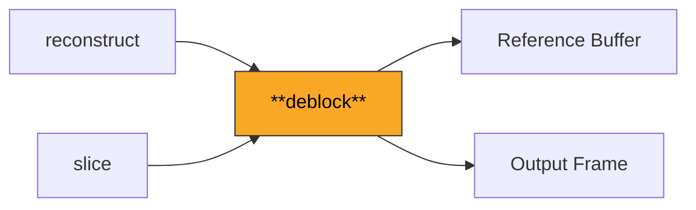
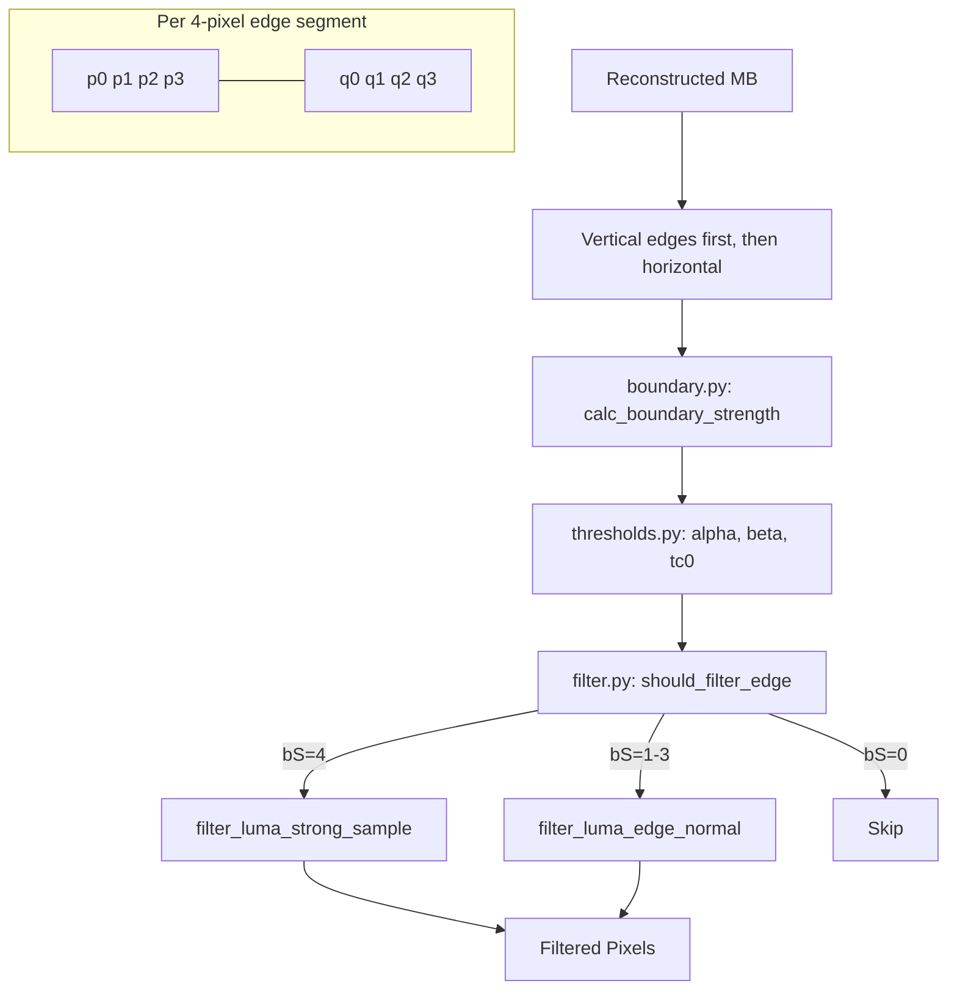

# Deblock

Applies the in-loop deblocking filter to reduce blocking artifacts at macroblock and sub-block boundaries. Filters are applied after full-frame reconstruction and before the frame enters the reference picture buffer, ensuring filtered output is used for future inter prediction.

**H.264 Spec Reference:** Section 8.7 (Deblocking filter process), Section 8.7.2.1 (Boundary strength), Section 8.7.2.3 (Filtering process)

## What It Does

Block-based coding inherently creates discontinuities at block boundaries. The deblocking filter smooths these edges with strength proportional to the coding decision at each boundary. This is an "in-loop" filter, meaning its output feeds back into the reference buffer for future prediction -- so it must be bit-exact across all decoder implementations.

The filter processes each macroblock's edges in a specific order: all vertical edges first (left to right: columns 0, 4, 8, 12), then all horizontal edges (top to bottom: rows 0, 4, 8, 12). For each 4-pixel edge segment, a boundary strength (bS) is calculated from the coding properties of the two adjacent blocks. The bS value (0-4) determines filter aggressiveness, and threshold tables indexed by QP control when and how strongly to filter.

At bS=4 (intra boundaries), a strong filter modifies up to 3 pixels on each side. At bS=1-3 (inter boundaries with coefficient or MV differences), a weaker filter modifies 1-2 pixels. At bS=0, no filtering occurs. The alpha and beta thresholds ensure that true edges in the image content (rather than coding artifacts) are preserved.

## Pipeline Position



## Architecture



## Key Files

| File | Lines | Description |
|------|-------|-------------|
| `deblock.py` | 1716 | Main deblocking orchestration: `deblock_macroblock`, edge ordering, luma and chroma filtering loops, 8x8 transform support |
| `boundary.py` | 409 | Boundary strength calculation: `calc_boundary_strength` (bS 0-4), 8x8 variant, mixed-transform edge handling |
| `filter.py` | 290 | Sample-level filtering: `should_filter_edge`, strong filter (bS=4), normal filter (bS=1-3), chroma filter |
| `thresholds.py` | 201 | Lookup tables from spec: `ALPHA_TABLE`, `BETA_TABLE`, `TC0_TABLE`, `QPC_TABLE` for chroma QP mapping |

## Key Concepts

**Boundary Strength (bS).** Determined per 4x4 block edge based on the blocks on each side:
```
bS=4: Either block is intra-coded (strongest filter)
bS=3: One block has non-zero transform coefficients
bS=2: Blocks use different reference frames
bS=1: MV difference >= 4 quarter-pixels (1 full pixel)
bS=0: No filtering needed
```
I_PCM blocks are an exception: bS=0 (no filtering at PCM boundaries).

**Alpha/Beta Thresholds.** Before filtering, three conditions must all be true:
```
|p0 - q0| < alpha(indexA)
|p1 - p0| < beta(indexB)
|q1 - q0| < beta(indexB)
```
where `indexA = Clip3(0, 51, QP + slice_alpha_c0_offset)` and similarly for indexB. These ensure natural edges are preserved.

**Normal Filter (bS=1-3).** Modifies p0 and q0, with optional p1/q1 correction:
```
delta = Clip3(-tc, tc, ((q0 - p0) * 4 + (p1 - q1) + 4) >> 3)
p0' = Clip1(p0 + delta)
q0' = Clip1(q0 - delta)
```
The clipping bound `tc = tc0 + 1` (for luma), where tc0 comes from `TC0_TABLE[indexA][bS-1]`.

**Strong Filter (bS=4).** When `|p2 - p0| < beta` (and similarly for q), the strong path modifies p0, p1, p2:
```
p0' = (p2 + 2*p1 + 2*p0 + 2*q0 + q1 + 4) >> 3
p1' = (p2 + p1 + p0 + q0 + 2) >> 2
p2' = (2*p3 + 3*p2 + p1 + p0 + q0 + 4) >> 3
```

**Chroma Filtering.** Chroma edges are filtered at half the spatial resolution (every 8 pixels in the frame, which is every 4 pixels in the chroma plane). Chroma uses the same bS values but its own QP from the `QPC_TABLE`, and the filter is simpler (only p0 and q0 are modified).

## Example

```python
from deblock.deblock import deblock_macroblock
from deblock.boundary import calc_boundary_strength
from deblock.thresholds import get_alpha, get_beta

# Calculate bS for an edge between two blocks
bs = calc_boundary_strength(
    is_intra_p=False, is_intra_q=True,
    has_coeff_p=False, has_coeff_q=True,
    mv_p=(4, 0), mv_q=(0, 0),
    ref_p=0, ref_q=0,
)
# bs = 4 (q is intra)

alpha = get_alpha(qp=28, offset=0)  # 20
beta = get_beta(qp=28, offset=0)    # 7
```

## Spec Compliance Notes

- For B-frames with L1-only uniprediction, bS must compare L1 reference/MV values, not L0. The L0 values for such blocks are -1 (ref) and (0,0) (MV), which are meaningless and would produce incorrect bS calculations.
- CABAC intra MBs in P/B-slices must store the canonical intra mb_type (0-25), not the raw CABAC mb_type (which has offsets of 5 for P-slices and 23 for B-slices). The deblocking filter's `_is_intra()` check only recognizes types 0-25.
- The filter processes vertical edges before horizontal edges within each macroblock (Section 8.7). The vertical pass modifies pixels that the horizontal pass then reads, so reversing the order produces different output.
