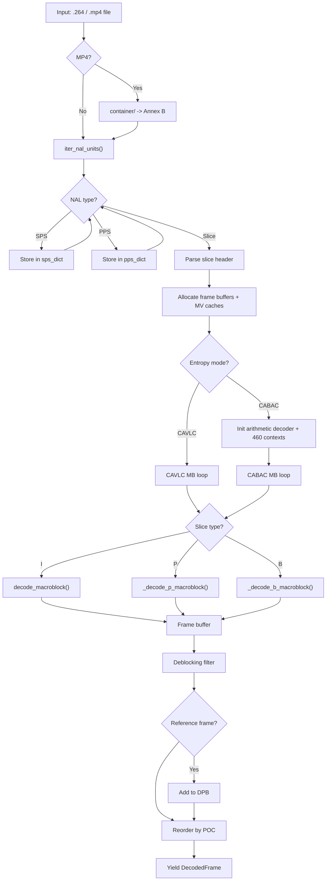

# decoder/

Main orchestration module that drives the complete H.264 decoding pipeline.
Takes a raw Annex B bitstream or MP4 file and produces decoded YCbCr/RGB
frames by coordinating all other modules: NAL parsing, parameter sets, slice
headers, entropy decoding, prediction, transform, reconstruction, deblocking,
and color conversion.

**H.264 Spec Reference: Section 7 (Syntax), Section 8 (Decoding process)**

## The Main Decode Loop

The decoder processes one NAL unit at a time. SPS and PPS NALs are stored.
Slice NALs trigger the full per-macroblock decode pipeline. After all MBs in a
picture are decoded, the deblocking filter runs, and the result is either
stored in the decoded picture buffer (reference frames) or output for display.



## Decode Order vs Display Order

H.264 decodes frames in a different order than it displays them. B-frames
reference both past and future frames, so the "future" reference must be
decoded first. The Picture Order Count (POC) tells us the correct display
sequence.

```
Decode order:   I0    P3    B1    B2    P6    B4    B5
                 |     |     |     |     |     |     |
Display order:  I0    B1    B2    P3    B4    B5    P6
                POC=0  POC=2 POC=4 POC=6 POC=8 POC=10 POC=12
```

The `POCCalculator` (in `poc.py`) implements three POC types from the spec:
- **Type 0**: Explicit LSB in each slice header, MSB derived with wraparound
  detection. Most common in practice.
- **Type 1**: Delta-based, uses a reference frame number cycle.
- **Type 2**: Directly from `frame_num` -- no B-frames possible.

At IDR boundaries, all POC state resets to zero.

## Decoded Picture Buffer (DPB)

The DPB stores reference frames that P and B macroblocks use for motion
compensation. Frames enter the DPB after decoding and stay until evicted.

```
DPB management:
+-------+-------+-------+-------+
| Slot0 | Slot1 | Slot2 | Slot3 |  max_num_ref_frames = 4
| I0    | P3    | P6    |  ---  |
+-------+-------+-------+-------+
     |       |       |
     v       v       v
  L0 list for P-slice: [P6, P3, I0]  (descending frame_num)
  L0 list for B-slice: [P3, I0]      (POC <= current, descending)
  L1 list for B-slice: [P6]          (POC > current, ascending)
```

**MMCO** (Memory Management Control Operations) from the slice header control
the DPB explicitly:
- Op 1: Mark a short-term reference as unused (by picNumX)
- Op 3: Assign a long-term frame index
- Op 5: Reset all references (acts like a mini-IDR)

Critical ordering: MMCO must be applied BEFORE adding the new reference frame
to the DPB. Without this, B-reference frames from earlier GOPs remain and
evict needed I/P references.

## Key Files

| File | Lines | Description |
|------|-------|-------------|
| `decoder.py` | ~5300 | Main `H264Decoder` class: NAL dispatch, I/P/B macroblock loops, CAVLC and CABAC paths, frame assembly, reference management |
| `poc.py` | 341 | `POCCalculator`: POC types 0/1/2, stateful MSB/LSB tracking |
| `mmco.py` | 298 | `MMCOProcessor`: mark unused, assign long-term, reset, DPB limits |
| `i8x8.py` | 1071 | I_8x8 decoder for High Profile: 8x8 prediction, reference sample filtering, scaling lists |
| `error_concealment.py` | 496 | Concealment strategies (temporal/spatial/zero), corrupt MB detection |
| `frame.py` | 84 | `FrameAssembler`: accumulates MB data into full Y/Cb/Cr buffers |
| `mbaff.py` | 484 | MBAFF (Macroblock-Adaptive Frame-Field) support structures |

## Error Handling

Two modes controlled by `error_resilience`:
- **Strict** (default): exceptions propagate immediately.
- **Resilient**: errors logged, corrupt NALs skipped. Concealment strategies
  (temporal copy from DPB, spatial interpolation, zero-fill) patch missing MBs.

## API Reference

| Method | Purpose |
|--------|---------|
| `H264Decoder.decode_file(path)` | Decode `.264` or `.mp4`, yields `DecodedFrame` |
| `H264Decoder.decode_bytes(data)` | Decode Annex B bytes, yields `DecodedFrame` |
| `DecodedFrame.to_rgb()` | Convert YCbCr frame to RGB `(H, W, 3)` uint8 |
| `DecodedFrame.luma` / `.cb` / `.cr` | Raw YUV 4:2:0 planes |

## Example

```python
from decoder.decoder import H264Decoder

decoder = H264Decoder()

# Decode from MP4 (auto-detected) or raw Annex B
for i, frame in enumerate(decoder.decode_file("video.mp4")):
    print(f"Frame {i}: {frame.width}x{frame.height}, POC={frame.poc}")
    rgb = frame.to_rgb()  # (H, W, 3) uint8 array
```

## Spec Compliance Notes

- MMCO applied BEFORE adding the new reference to the DPB.
- CABAC skip MBs clear `mb_coeffs` to prevent stale deblocking bS values.
- CABAC intra MBs in P/B-slices subtract type offset, mark MV cache intra.
- Reference lists follow H.264 8.2.4 with modification command support.
