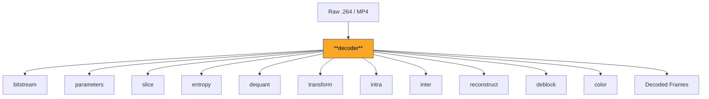
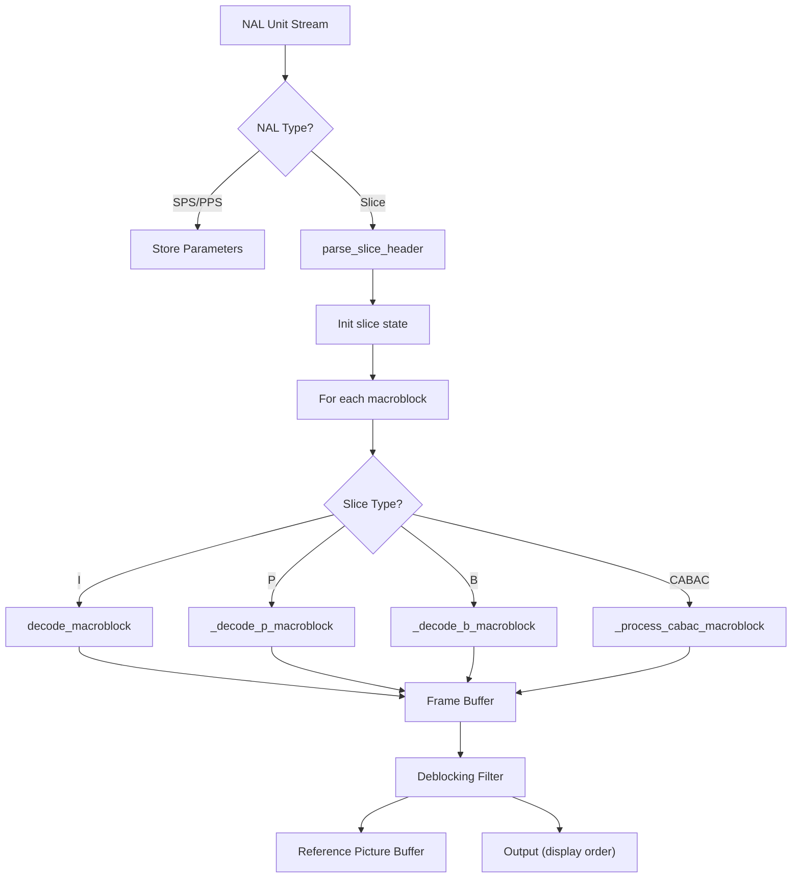

# Decoder

The main orchestration module that drives the complete H.264 decoding pipeline. Takes a raw bitstream or MP4 file and produces decoded YCbCr/RGB frames by coordinating all other modules: NAL parsing, parameter sets, slice headers, entropy decoding, prediction, transform, reconstruction, deblocking, and color conversion.

**H.264 Spec Reference:** Section 7 (Syntax and semantics), Section 8 (Decoding process)

## What It Does

This module is the top-level entry point for decoding. It maintains all decoder state -- parameter sets, reference picture buffer, picture order count, motion vector caches, non-zero coefficient counts -- and processes each NAL unit in sequence. For SPS and PPS NAL units, it parses and stores the parameter sets. For slice NAL units, it parses the slice header, initializes per-slice state, and then iterates over each macroblock in the slice, dispatching to the appropriate reconstruction path.

For I-slices, each macroblock is sent to the reconstruct module which handles intra prediction and residual decoding. For P-slices, the decoder parses the macroblock type and partition structure, predicts motion vectors, performs motion compensation from reference frames, decodes residuals, and combines prediction with residual. For B-slices, the decoder additionally handles bi-prediction, direct mode MV derivation, and dual reference lists.

CABAC and CAVLC entropy coding are both supported: CABAC slices initialize the arithmetic decoder and context models at slice start, then decode each macroblock's syntax elements through the CABAC machinery. After all macroblocks in a picture are decoded, the deblocking filter is applied, and the result is stored in the reference picture buffer (for reference frames) and output for display. POC calculation determines the correct display order.

## Pipeline Position



## Architecture



## Key Files

| File | Lines | Description |
|------|-------|-------------|
| `decoder.py` | 5349 | Main decoder class: NAL dispatch, I/P/B-slice macroblock loops, CAVLC and CABAC paths, frame assembly, reference management |
| `poc.py` | 341 | Picture Order Count calculator: POC types 0, 1, and 2, stateful MSB/LSB tracking for display ordering |
| `i8x8.py` | 1071 | I_8x8 macroblock decoder for High profile: 8x8 prediction, reference sample filtering, transform, scaling list integration |
| `mmco.py` | 298 | Memory Management Control Operations: mark short-term unused, assign long-term index, reset, DPB size enforcement |
| `error_concealment.py` | 496 | Error handling: concealment strategies (temporal, spatial, zero), corrupt MB detection, missing MB detection |
| `frame.py` | 84 | `FrameAssembler` class: accumulates macroblock data into full Y/Cb/Cr frame buffers from slice-by-slice decoding |
| `mbaff.py` | 484 | MBAFF (Macroblock-Adaptive Frame-Field) coding support structures |

## Key Concepts

**Decoder State.** The decoder maintains per-frame state including: the current SPS and PPS, a `ReferenceFrameBuffer` (DPB), two `MVCache` instances (L0 and L1), non-zero coefficient count arrays, per-MB QP tracking, and a `POCCalculator`. State is reset at IDR boundaries.

**POC Calculation.** Three modes determine display order. Type 0 (most common) tracks `pic_order_cnt_msb` and uses `pic_order_cnt_lsb` from the slice header with wraparound detection. At IDR boundaries, both MSB and LSB reset to 0. The POC drives reference list sorting for B-frames.

**MMCO Processing.** Memory Management Control Operations (decoded from the slice header) control the DPB. Operation 1 marks a short-term reference as unused. Operation 3 assigns a long-term frame index. Operation 5 resets all references (like a mini-IDR). MMCO must be applied before adding the new reference frame to the DPB.

**CABAC Slice Flow.** For CABAC slices: (1) initialize the arithmetic decoder from the bitstream, (2) initialize 460 context models using slice type and QP, (3) for each MB, decode `mb_skip_flag`, `mb_type`, and all syntax elements via context-based arithmetic decoding, (4) dispatch to `_reconstruct_intra_mb_cabac` or `_reconstruct_inter_mb_cabac`.

**Reference List Construction.** L0 for P-slices: short-term refs in descending frame_num order. L0 for B-slices: refs with POC <= current sorted by descending POC, then refs with POC > current by ascending POC. L1 for B-slices: the reverse ordering. Both lists can be modified by ref_pic_list_modification commands.

## Example

```python
from decoder.decoder import H264Decoder

decoder = H264Decoder()

with open("video.264", "rb") as f:
    bitstream = f.read()

for i, frame in enumerate(decoder.decode_bytes(bitstream)):
    # frame.luma is (H, W) uint8
    # frame.cb, frame.cr are (H/2, W/2) uint8
    print(f"Frame {i}: {frame.luma.shape}, POC={frame.poc}")
```

## Spec Compliance Notes

- MMCO operations must be applied BEFORE adding the new reference frame to the DPB. Without this ordering, B-reference frames from earlier GOPs remain in the DPB and evict needed I/P references.
- CABAC skip MBs must clear `mb_coeffs` (not just nz_counts and dc_cbf), otherwise stale coefficient values from previous MBs cause incorrect deblocking filter bS calculations.
- CABAC intra MBs in P/B-slices must: (1) store canonical intra mb_type (subtract 5 for P-slice, 23 for B-slice offsets), (2) call `mv_cache.mark_intra()` so neighbors see ref=-1 rather than unavailable, (3) update nz_counts and QP. Missing any of these causes cascading errors in subsequent MBs.
