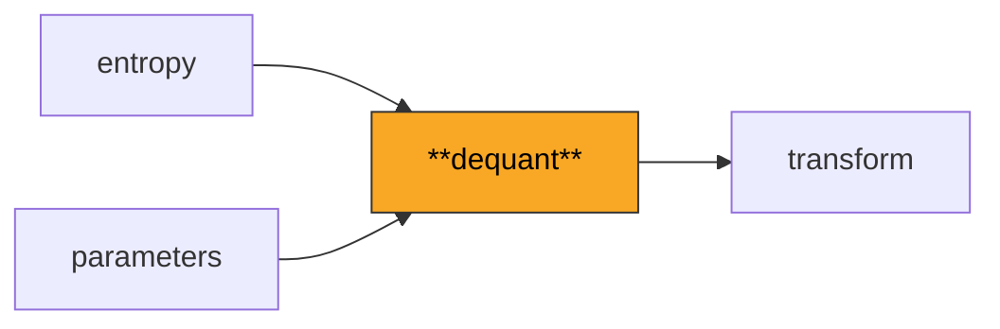
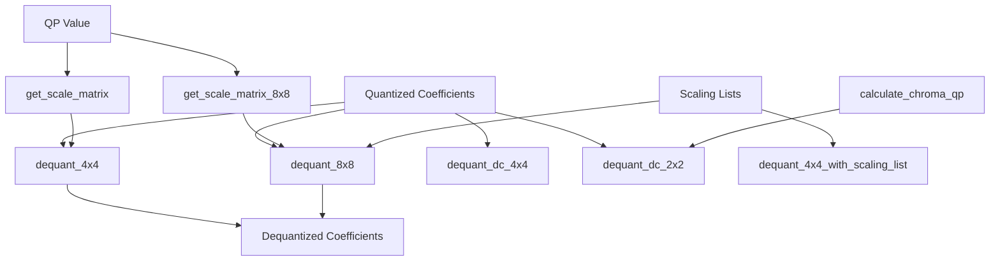

# Dequant

Applies inverse quantization to transform coefficients, reversing the lossy compression step that maps continuous frequency values to discrete integer levels. Handles both 4x4 and 8x8 blocks with position-dependent scaling.

**H.264 Spec Reference:** Section 8.5.11 (Scaling and transformation process), Table 8-13 (LevelScale), Table 8-15 (Chroma QP mapping)

## What It Does

Quantization is where H.264 achieves most of its compression -- by dividing transform coefficients by a quantization step size, small values are zeroed out while larger values are reduced in magnitude. Dequantization reverses this process, scaling the integer levels back up to approximate the original frequency-domain coefficients before they enter the inverse transform.

H.264's dequantization is position-dependent: different positions in the 4x4 or 8x8 block have different scaling factors, determined by the `LevelScale` lookup table indexed by `QP % 6` and a position type. The QP (Quantization Parameter) ranges from 0 to 51, where every increase of 6 doubles the quantization step size. The `QP // 6` component contributes a power-of-two shift, while `QP % 6` selects one of six sets of scaling factors.

For High profile, custom scaling lists from SPS/PPS replace the default position-dependent weights, enabling encoder-tuned quantization. Chroma components use a separate QP derived through a nonlinear mapping table that compresses the high end of the range, reducing chroma artifacts at aggressive compression levels.

## Pipeline Position



## Architecture



## Key Files

| File | Lines | Description |
|------|-------|-------------|
| `dequant.py` | 457 | Core dequantization: `dequant_4x4`, `dequant_8x8`, DC-specific variants for luma and chroma, custom scaling list support, chroma QP mapping |
| `chroma_qp.py` | 28 | Chroma QP calculation: `calculate_chroma_qp` applies the offset and lookups through the nonlinear QPC table |

## Key Concepts

**LevelScale Table.** A 6x3 table (H.264 Table 8-13) indexed by `QP % 6` and a position type (0=corner, 1=center, 2=other). For 8x8 blocks, a 6x6 table with 6 position types is used. These tables encode the fractional part of the quantization step.

**QP Division.** The QP is split into `qp_div_6 = QP // 6` (power-of-two shift) and `qp_mod_6 = QP % 6` (table index). The dequantized value is:
```
d[i,j] = coeffs[i,j] * LevelScale[qp_mod_6][pos_type] << qp_div_6
```

**DC Coefficient Scaling.** Luma DC coefficients (I_16x16 mode) and chroma DC coefficients have special scaling rules because they undergo an additional Hadamard transform. For `QP >= 12`, the formula shifts left by `qp_div_6 - 2`; for `QP < 12`, it shifts right by `2 - qp_div_6` with rounding.

**Chroma QP Mapping.** Luma QP does not directly apply to chroma. The `QPC_TABLE` maps `qPI = luma_QP + chroma_qp_index_offset` to a chroma QP. For `qPI <= 29`, `QPC = qPI`. Above 29, chroma QP grows more slowly to limit chroma distortion.

**Custom Scaling Lists.** High profile scaling lists (16 elements for 4x4, 64 for 8x8) are in zigzag scan order. The dequant function converts them to raster order and multiplies them with the base LevelScale values, using the full-precision formula from Section 8.5.12.1.

## Example

```python
from dequant import dequant_4x4, dequant_dc_2x2, get_chroma_qp
import numpy as np

# Dequantize a 4x4 luma block at QP=28
quantized = np.array([[3, -1, 0, 0],
                       [1, 0, 0, 0],
                       [0, 0, 0, 0],
                       [0, 0, 0, 0]], dtype=np.int32)
dequantized = dequant_4x4(quantized, qp=28)

# Chroma QP from luma QP with offset
chroma_qp = get_chroma_qp(luma_qp=35)  # Returns 33 (nonlinear mapping)
```

## Spec Compliance Notes

- The 8x8 dequantization with scaling lists uses the exact spec formula from Section 8.5.12.1: for `qp_div_6 >= 6`, `d = (c * LevelScale) << (qp_div_6 - 6)`; for `qp_div_6 < 6`, `d = (c * LevelScale + 2^(5-qp_div_6)) >> (6 - qp_div_6)`. The rounding offset is critical for bit-exactness.
- C-style truncation toward zero (not Python's floor division) is used for chroma DC dequantization at low QP via the `_rshift_toward_zero` helper.
- The chroma QP mapping table compresses QP values above 29 -- a QP of 51 maps to chroma QPC of only 39 -- which is essential for preventing severe chroma blocking at high compression.
