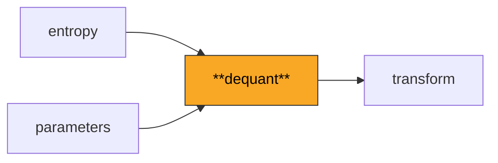
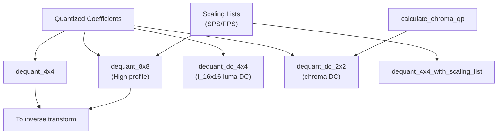

# Dequant

Inverse quantization: scales integer coefficient levels back to approximate
frequency-domain values before they enter the inverse transform. Handles
4x4 and 8x8 blocks with position-dependent scaling, custom scaling lists
(High profile), and chroma QP mapping.

**H.264 Spec Reference:** Section 8.5.11 (Scaling and transformation),
Table 8-13 (LevelScale), Table 8-15 (Chroma QP mapping)

## Why Dequantization Matters

Quantization is where H.264 throws away information. The encoder divides
transform coefficients by a step size, rounding small values to zero --
the main source of both compression and artifacts. The decoder must
reverse this, multiplying back up using the same step size the encoder
chose via the QP (Quantization Parameter).

## Pipeline Position



## QP to Quantization Step: The Exponential Rule

QP ranges 0 (finest) to 51 (coarsest). Every +6 doubles the step size.

```
QP:     0     6    12    18    24    30    36    42    48    51
Qstep:  0.625 1.25  2.5   5    10    20    40    80   160   224

Internally:  qp_div_6 = QP // 6  -->  power-of-two shift
             qp_mod_6 = QP %  6  -->  LevelScale table index
```

## The LevelScale Table and Position-Dependent Scaling

Different positions in a 4x4 block need different scale factors because
DCT basis functions have different norms. H.264 Table 8-13:

```
Position types in a 4x4 block:        LevelScale[qp%6][type]:

    C  o  C  o       C = corner (0)     qp%6  corner  center  other
    o  X  o  X       X = center (1)      0:     10      16      13
    C  o  C  o       o = other  (2)      1:     11      18      14
    o  X  o  X                           2:     13      20      16
                                         3:     14      23      18
                                         4:     16      25      20
                                         5:     18      29      23

Formula:  d[i,j] = coeff[i,j] * LevelScale[qp%6][pos_type(i,j)] << qp_div_6
```

## Worked Example: QP = 28

```
qp_div_6 = 4,  qp_mod_6 = 4  -->  LevelScale row 4: corner=16, center=25, other=20

Scale matrix:                   Quantized input:         Dequantized output:
  [ 16  20  16  20 ]             [  3  -1   0   0 ]       [  768  -320    0    0 ]
  [ 20  25  20  25 ]      x      [  1   0   0   0 ]  <<4  [  320     0    0    0 ]
  [ 16  20  16  20 ]             [  0   0   0   0 ]   =   [    0     0    0    0 ]
  [ 20  25  20  25 ]             [  0   0   0   0 ]       [    0     0    0    0 ]

  e.g. position (0,0): 3 * 16 * 2^4 = 3 * 16 * 16 = 768
       position (0,1): -1 * 20 * 2^4 = -320
```

## Architecture



## DC Coefficient Scaling

Luma DC (I_16x16) and chroma DC pass through an extra Hadamard, so their
dequant formula compensates for the additional scale factor:

```
Luma DC:   QP >= 12:  d = (c * LevelScale[qp%6][0]) << (qp_div_6 - 2)
           QP <  12:  d = (c * LevelScale + round) >> (2 - qp_div_6)
Chroma DC: similar, with threshold at QP >= 6
```

## Chroma QP Mapping

Luma QP does not directly apply to chroma. A nonlinear mapping compresses
chroma QP at the high end to limit chroma blocking:

```
Luma QP:    0 ... 29  30  32  34  36  40  44  48  51
Chroma QP:  0 ... 29  29  31  32  34  36  37  39  39
                      ^-- above 29, chroma QP grows slower
                          QP=51 maps to chroma QP=39
```

## Custom Scaling Lists (High Profile)

Encoder-tuned weights from SPS/PPS (16 elements for 4x4, 64 for 8x8, in
zigzag order). Converted to raster order and multiplied with LevelScale.
When no scaling lists are signaled, flat weights (all 16s) reduce to the
standard formula.

## Key Files

| File | Description |
|------|-------------|
| `dequant.py` | Core dequantization: 4x4/8x8, DC variants, scaling lists, LevelScale tables |
| `chroma_qp.py` | `calculate_chroma_qp(luma_qp, offset)` with nonlinear table lookup |

## API Quick Reference

```python
from dequant import dequant_4x4, dequant_8x8, dequant_dc_4x4, dequant_dc_2x2
from dequant import get_chroma_qp, qp_to_qstep
from dequant.chroma_qp import calculate_chroma_qp

dequantized = dequant_4x4(quantized_coeffs, qp=28)
dequantized = dequant_8x8(coeffs, qp=28, scaling_list=sl_64)  # High profile
dc_luma     = dequant_dc_4x4(hadamard_output, qp=28)
dc_chroma   = dequant_dc_2x2(hadamard_output, qp=25)
chroma_qp   = calculate_chroma_qp(luma_qp=35, chroma_qp_index_offset=-2)
```

## Spec Compliance Notes

- C-style truncation toward zero (not Python floor division) for chroma DC
  at low QP, via `_rshift_toward_zero`.
- The 8x8 rounding offset `2^(5-qp_div_6)` is critical for bit-exactness.
- QP is clamped to [0, 51] at every entry point.
