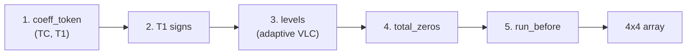
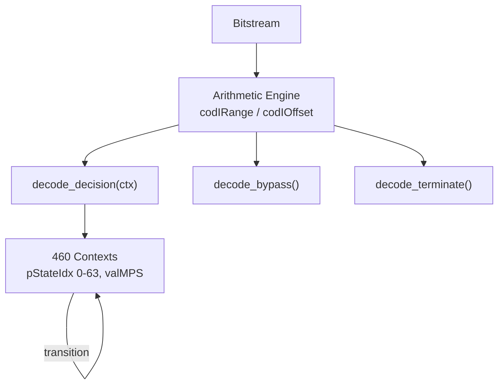

# Entropy Decoding

Reverses the final compression layer in H.264. After prediction and transform,
coefficients and syntax elements are entropy-coded using CAVLC or CABAC. This
module decodes them back to integer arrays.

**H.264 Spec:** Section 9.2 (CAVLC), Section 9.3 (CABAC)

## Pipeline Position

```
bitstream --> parameters --> slice --> [ENTROPY] --> dequant --> transform
                                          |
                                          +--> decoder (syntax elements)
```

## CAVLC vs CABAC

```
                CAVLC                          CABAC
  +---------------------------------+  +---------------------------------+
  | Variable-length code tables     |  | Binary arithmetic coding        |
  | Selected by neighbor context    |  | 460 adaptive context models     |
  | Baseline / Main profile         |  | Main / High profile             |
  | ~10-15% larger bitstreams       |  | Best compression ratio          |
  | entropy_coding_mode_flag = 0    |  | entropy_coding_mode_flag = 1    |
  +---------------------------------+  +---------------------------------+
```

## CAVLC: Five-Step Block Decoding



Context **nC** selects the VLC table: `nC = (nA + nB + 1) >> 1` where nA/nB
are left/top neighbor non-zero counts. Range -1 (chroma DC) through 8+ (fixed).

### Worked Example

```
Step 1: coeff_token --> TotalCoeff=4, TrailingOnes=3
Step 2: T1 signs    --> 3 bits: 1,0,0 -> reversed: [+1, -1, -1]
Step 3: Levels      --> 1 non-T1 level: prefix=0, suffix=0
        level_code=0, first-level +1 adjust --> level=+3
Step 4: total_zeros --> VLC with TC=4: total_zeros=3
Step 5: run_before  --> runs [1,0,1,1] distribute 3 zeros

Result:  pos [0] [1] [2] [3] [4] [5] [6] ...
              3   0  -1   0  -1   0  +1    (zeros to pos 15)
```

The suffix_length adapts: starts at 0 (or 1 when TC>10 and T1<3), increases
when decoded levels exceed `3 << (suffix_length - 1)`.

## CABAC: Arithmetic Coding Engine



The engine partitions an interval into MPS/LPS sub-ranges:

```
  qIdx = (codIRange >> 6) & 3
  rLPS = rangeTabLPS[pStateIdx][qIdx]
  codIRange -= rLPS                        -- MPS gets upper portion

  if codIOffset >= codIRange:              -- LPS decoded
      codIOffset -= codIRange;  codIRange = rLPS
      bin = 1 - valMPS
      pStateIdx = transIdxLPS[pStateIdx]
  else:                                    -- MPS decoded
      bin = valMPS
      pStateIdx = transIdxMPS[pStateIdx]

  while codIRange < 256:                   -- renormalize to [256,510]
      codIRange <<= 1
      codIOffset = (codIOffset << 1) | read_bit()
```

Context init per-slice: `preCtxState = Clip3(1, 126, ((m*QP)>>4) + n)`.

### CABAC Residual: Significance Map

Coefficients use a two-pass decode -- scan for positions, then read levels:

```
  Pass 1: significant_coeff_flag[i] + last_significant_coeff_flag[i]
  Pass 2: coeff_abs_level_minus1 (context+bypass) + coeff_sign_flag (bypass)
```

Binarization schemes: unary, truncated unary, UEGk (exp-golomb), fixed-length.

## Key Files

| File | Purpose |
|------|---------|
| `cavlc.py` | CAVLC decoder: coeff_token, levels, total_zeros, run_before, zigzag |
| `cabac_arith.py` | Arithmetic engine: decision, bypass, terminate, renormalization |
| `cabac_context.py` | 460 context models with (m,n) initialization tables |
| `cabac_binarize.py` | Binarization: unary, truncated unary, fixed-length, UEGk |
| `cabac_syntax.py` | Syntax elements: mb_type, MVD, ref_idx, CBP, QP delta |
| `cabac_macroblock.py` | MB-level CABAC: dispatches intra/inter decoding |
| `cabac_residual.py` | Coefficient decoding: significance map, levels, signs |
| `tables.py` | VLC lookup tables and zigzag scan patterns (4x4, 2x2, 8x8) |

## API

```python
from entropy.cavlc import decode_residual_4x4, decode_chroma_dc, calculate_nC

nC = calculate_nC(nA=3, nB=2)           # neighbor context
coeffs = decode_residual_4x4(reader, nC) # (4,4) int32
chroma = decode_chroma_dc(reader)        # (2,2) int32
```

## Spec Compliance Notes

- CABAC `ref_idx`: standard unary (trailing 0), not truncated unary.
  Context increment: `condTermFlagA + 2*condTermFlagB`.
- CABAC MVD bin0 context: `|mvdA|+|mvdB|` mapped to {<3:0, 3-32:1, >32:2}.
- CAVLC level escape: `level_code += (1<<(level_prefix-3)) - 4096` for prefix>=15.
