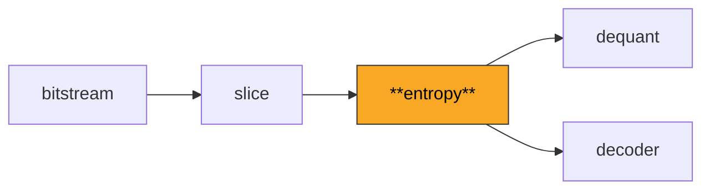
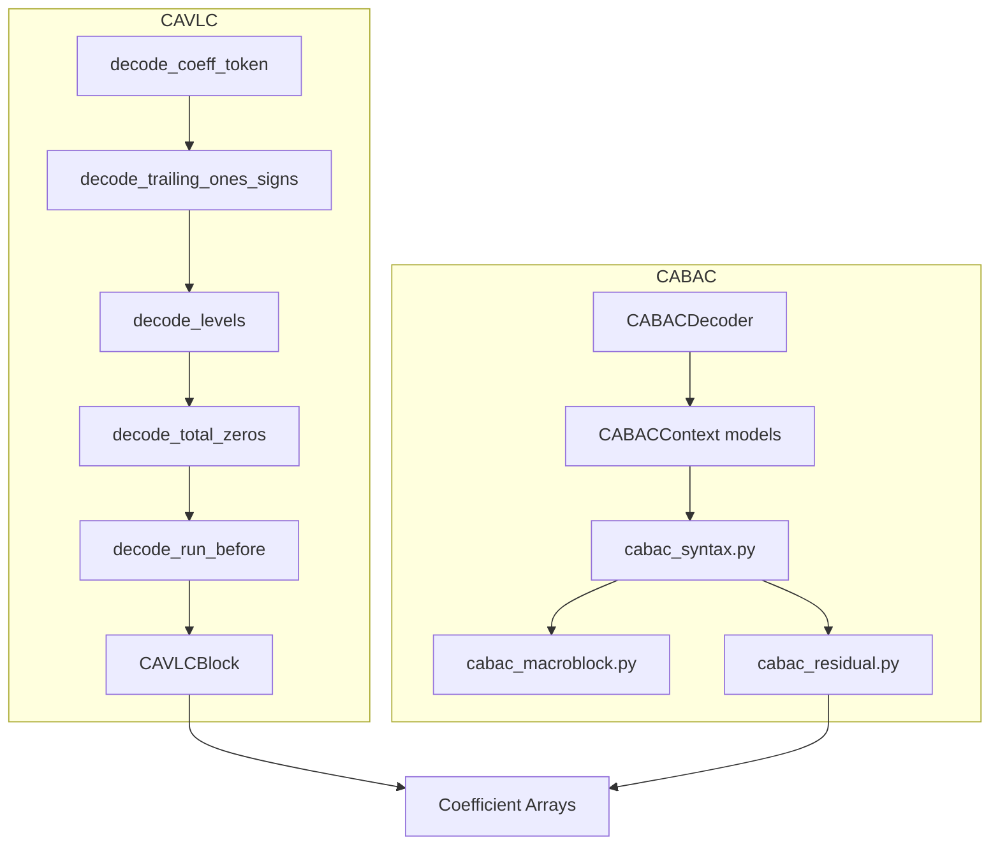

# Entropy

Implements both CAVLC (Context-Adaptive Variable-Length Coding) and CABAC (Context-Adaptive Binary Arithmetic Coding) entropy decoders for H.264 transform coefficients and syntax elements.

**H.264 Spec Reference:** Section 9.2 (CAVLC), Section 9.3 (CABAC)

## What It Does

Entropy coding is the final layer of compression in H.264. After prediction and transform, the resulting coefficient values and syntax elements are entropy-coded using either CAVLC (Baseline/Main profile) or CABAC (Main/High profile). This module reverses that encoding to recover the original integer values.

CAVLC encodes transform coefficients using context-dependent VLC tables. For each 4x4 block, it decodes five elements in order: `coeff_token` (giving TotalCoeff and TrailingOnes), trailing ones sign bits, level values (coefficient magnitudes), `total_zeros`, and `run_before` values (distributing zeros between coefficients). The VLC table selection depends on `nC`, the average of non-zero counts from neighboring blocks.

CABAC is a more sophisticated binary arithmetic coder that achieves 10-15% better compression. It maintains 460 context models, each tracking a probability state (0-63) and a most probable symbol (MPS). Every syntax element is binarized into a sequence of binary decisions, each decoded against the appropriate context. The arithmetic engine maintains a range `codIRange` (kept in [256, 510] by renormalization) and an offset `codIOffset` read from the stream. At the macroblock level, CABAC decodes mb_type, sub_mb_type, motion vectors, reference indices, CBP, QP delta, and coefficient blocks.

## Pipeline Position



## Architecture



## Key Files

| File | Lines | Description |
|------|-------|-------------|
| `cavlc.py` | 764 | Complete CAVLC decoder: coeff_token, levels, total_zeros, run_before, block assembly with zigzag reordering |
| `cabac_arith.py` | 238 | Binary arithmetic decoder engine: `decode_decision`, `decode_bypass`, `decode_terminate`, renormalization |
| `cabac_context.py` | 2066 | 460 CABAC context models: initialization from (m,n) tables, context index constants, state transitions |
| `cabac_macroblock.py` | 2258 | MB-level CABAC: mb_type, sub_mb_type, motion vectors, ref_idx, CBP, intra modes, QP delta, residual dispatch |
| `cabac_residual.py` | 857 | CABAC coefficient decoding: significance map, last coefficient flag, absolute levels, sign bypass bins |
| `cabac_syntax.py` | 809 | Low-level CABAC syntax elements: binarization schemes, context index derivation for each element |
| `cabac_binarize.py` | 395 | Binarization helpers: unary, truncated unary, fixed-length, and UEG (Unary/Exp-Golomb) schemes |
| `tables.py` | 610 | VLC lookup tables for CAVLC: coeff_token tables (4 nC ranges + chroma DC), total_zeros, run_before, zigzag scans |

## Key Concepts

**Context nC.** CAVLC selects its `coeff_token` table based on `nC = (nA + nB + 1) >> 1`, where nA and nB are non-zero coefficient counts from left and top neighbor blocks. For chroma DC blocks, `nC = -1` selects a special table.

**Exp-Golomb Level Coding.** CAVLC levels use an adaptive VLC where `suffix_length` starts at 0 (or 1 for blocks with >10 coefficients) and increases as larger levels are encountered. The first non-trailing-one level has its magnitude incremented by 1 when `trailing_ones < 3`.

**CABAC Arithmetic Engine.** The decoder partitions the probability interval into MPS and LPS ranges using `rangeTabLPS[pStateIdx][qCodIRangeIdx]`. After each decision, the context state transitions via `transIdxMPS` or `transIdxLPS` tables, adapting to the local statistics.

**CABAC Context Initialization.** Each of the 460 contexts is initialized from per-slice-type (m, n) parameter pairs:
```
preCtxState = Clip3(1, 126, ((m * SliceQP) >> 4) + n)
valMPS = 1 if preCtxState >= 64 else 0
pStateIdx = preCtxState - 64 if valMPS else 63 - preCtxState
```

**Significance Map.** CABAC coefficient decoding uses a two-pass approach: first decode which scan positions are significant (`significant_coeff_flag`) and which is the last (`last_significant_coeff_flag`), then decode magnitudes and signs for the significant positions.

## Example

```python
from bitstream import BitReader
from entropy import decode_residual_4x4, calculate_nC

reader = BitReader(block_rbsp_data)
nC = calculate_nC(nA=3, nB=2)  # Average of neighbor non-zero counts
coeffs_4x4 = decode_residual_4x4(reader, nC)
# coeffs_4x4 is a (4, 4) int32 array in raster order
```

## Spec Compliance Notes

- CABAC `ref_idx` uses standard unary binarization (always with a trailing 0 bin), not truncated unary. The context increment is `condTermFlagA + 2 * condTermFlagB`, not the sum. These are frequently confused.
- CABAC MVD bin0 context selection depends on the sum `|mvdA| + |mvdB|` from neighbors, mapped to context increments {<3:0, 3-32:1, >32:2}. Per-4x4-block MVDs must be stored in `mb_mvds_l0` for correct cross-MB neighbor lookups.
- The `_compute_level_code` function implements the escape path for `level_prefix >= 15`: `level_code += (1 << (level_prefix - 3)) - 4096`. This is essential for decoding large coefficient values in high-quality streams.
