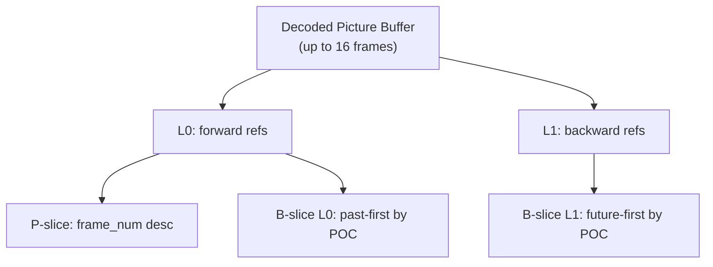

# Inter Prediction

Implements inter-frame prediction for P and B slices: motion vector prediction,
sub-pixel motion compensation, bi-directional prediction, direct mode MV
derivation, weighted prediction, and the decoded picture buffer (DPB).

**H.264 Spec:** Sections 8.4, 8.2, 8.4.1, 8.4.2

Inter prediction exploits temporal redundancy. For each partition, a motion
vector (MV) points to a matching region in a reference frame. The decoder
fetches that region, interpolates to sub-pixel accuracy, and uses it as the
prediction. The coded residual corrects the remaining error.

## Macroblock Partition Hierarchy

Each partition carries its own MV and reference index:

```
  16x16        16x8         8x16         8x8           8x8 sub-partitions:
 +------+    +------+    +---+---+    +---+---+     8x8  8x4  4x8  4x4
 |      |    |  0   |    |   |   |    | 0 | 1 |     +-+  +-+  ++++ ++++
 |  0   |    +------+    | 0 | 1 |    +---+---+     | |  +-+  ++++ ++++
 |      |    |  1   |    |   |   |    | 2 | 3 |     +-+  +-+  ++++ ++++
 +------+    +------+    +---+---+    +---+---+
```

P-slices use L0 (forward) references. B-slices add L1 (backward) and can flag
each partition as L0-only, L1-only, or bi-predicted.

## Motion Vector Prediction

MVs are not sent directly. The bitstream contains an MVD (difference), and the
decoder derives a predictor from spatial neighbors:

```
              +----+----+----+
              |         | C  |
              |    B    |(top-right)
              +----+----+----+
              |    |  current |
         A    |    |  block   |
        (left)+----+----------+

  MVP = median(MV_A, MV_B, MV_C)    [component-wise]
  MV  = MVP + MVD
```

Special cases: 16x8 top uses B directly, 16x8 bottom uses A, 8x16 left uses
A, 8x16 right uses C. When C is unavailable, D (top-left) substitutes.

The `MVCache` stores MVs at 4x4 block granularity, tracking MV, ref index, and
availability for cross-MB neighbor lookups.

## Sub-Pixel Interpolation

MVs have **quarter-pixel precision**. The fractional part (dx, dy in 0-3)
selects the interpolation method:

```
  Integer positions (G) and fractional positions for luma:

     G  b     G           G = integer (direct lookup)
              |           b = half-pel horizontal
     d  e  f  |           h = half-pel vertical
              |           j = half-pel diagonal (HV)
     G  h  j  G           d,e,f,... = quarter-pel
              |
     G        G

  Luma half-pel: 6-tap FIR [-1, 5, 20, 20, 5, -1] / 32
  Luma quarter-pel: average of adjacent integer and half-pel
  Chroma: bilinear interpolation at 1/8-pel precision
```

## Reference Picture Lists



**P-slices** build L0 from short-term refs in descending `frame_num` order.
**B-slices** sort L0 by ascending POC distance past-first; L1 reverses this.
`ref_pic_list_modification` reorders via shift-insert-compact (8.2.4.3.1).
MMCO marks frames unused or assigns long-term indices -- applied **before**
adding the current frame to the DPB.

## B-Frame Direct Mode

B_Direct and B_Skip derive MVs without transmitted data.
`direct_spatial_mv_pred_flag` selects the derivation method:

**Spatial:** ref indices = min of available neighbors; MVs from median
prediction. ColZeroFlag zeroes MVs when co-located has refIdx=0 and |mv|<=1.

**Temporal:** `MV_L0 = (tb/td) * MV_col`, `MV_L1 = MV_L0 - MV_col`.
B_Direct_16x16 is 4 independent 8x8 sub-blocks, each with its own colZeroFlag.

## Bi-Prediction and Weighted Prediction

```
Bi-pred:   result = (pred_L0 + pred_L1 + 1) >> 1
Explicit:  pred'  = ((w * pred + 2^(ld-1)) >> ld) + offset
Implicit:  w0 = tb*256/td,  w1 = 256 - w0    (POC-derived, handles fades)
```

## Pipeline Position

```
entropy / slice --> [inter] --> reconstruct --> deblock
```

## Key Files

| File | Purpose |
|------|---------|
| `mv_prediction.py` | `MVCache`, `predict_mv_partition()` for all partition sizes |
| `motion_comp.py` | 6-tap FIR luma, bilinear chroma, `get_luma_block_fractional()` |
| `reference.py` | `ReferenceFrame`, `ReferenceFrameBuffer`, MV field for temporal direct |
| `direct_mode.py` | `derive_direct_spatial()`, `derive_direct_temporal()` |
| `bipred.py` | `bipred_average()`, `weighted_bipred()` |
| `weighted_pred.py` | `WeightTable`, explicit and implicit weight application |
| `p_reconstruct.py` | P-MB reconstruction: skip, 16x16/16x8/8x16/8x8 sub-partitions |
| `b_reconstruct.py` | B-MB reconstruction: L0/L1/Bi-pred, direct, all partitions |
| `p_macroblock.py` | `PMBType`, `SubMBType` dataclasses, P-slice partition parsing |
| `b_macroblock.py` | 23 B-MB types, prediction mode flags (L0/L1/Bi) |

## Usage

```python
from inter.mv_prediction import MVCache, predict_mv_16x16
from inter.motion_comp import get_luma_block_fractional

mv_cache = MVCache(width_in_mbs=22, height_in_mbs=18)
mvp_x, mvp_y = predict_mv_16x16(mv_cache, mb_x=5, mb_y=3)
mvx, mvy = mvp_x + mvd_x, mvp_y + mvd_y  # Add decoded MVD

pred = get_luma_block_fractional(ref_luma, x=5*16, y=3*16,
                                 dx=mvx % 4, dy=mvy % 4,
                                 width=16, height=16)
```

## Spec Compliance Notes

- **B_Direct_16x16** must be 4 independent 8x8 sub-blocks (Section 8.4.1.2.2), each with its own colZeroFlag check.
- **ref_pic_list_modification** uses shift-insert-compact (Section 8.2.4.3.1), not simple pop/insert.
- **Deblock bS for L1-only blocks:** compare L1 ref/MV, not the L0 values (which are -1 / (0,0) garbage).
- **B_Skip QP:** must use the actual running slice QP for deblocking, not a default value.
