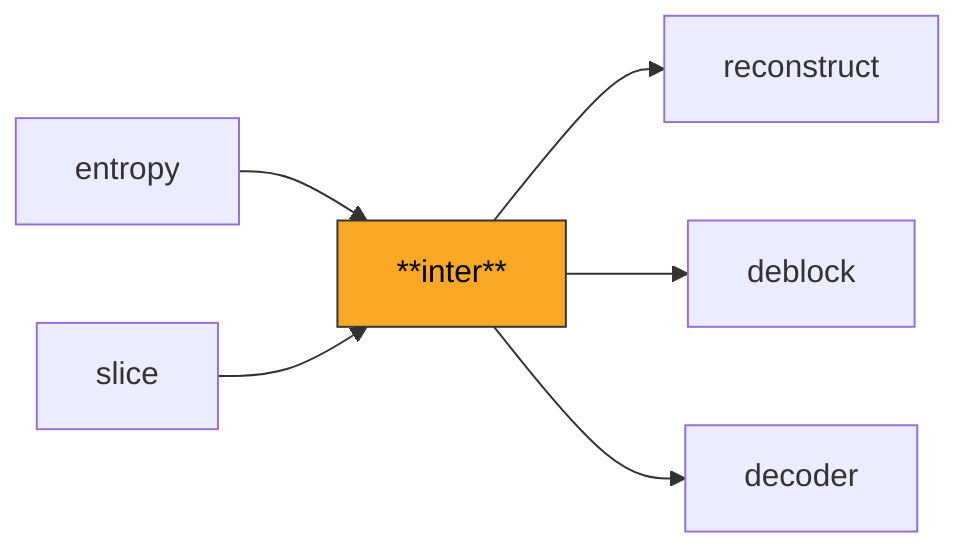
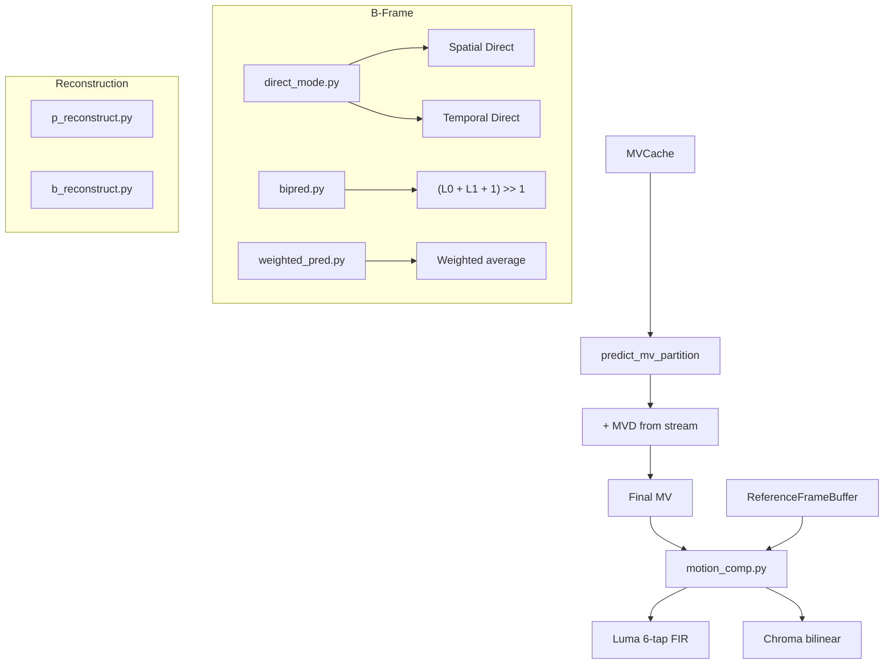

# Inter

Implements inter-frame prediction for P-frames and B-frames: motion vector prediction, sub-pixel motion compensation, bi-directional prediction, direct mode MV derivation, weighted prediction, and the decoded picture buffer (DPB) for reference frame management.

**H.264 Spec Reference:** Section 8.4 (Inter prediction), Section 8.2 (Reference picture management), Section 8.4.1 (MV prediction), Section 8.4.2 (Fractional sample interpolation)

## What It Does

Inter prediction exploits temporal redundancy by predicting blocks from previously decoded reference frames. For each inter-coded macroblock partition, a motion vector (MV) points to the location in the reference frame where the best match was found by the encoder. The decoder fetches the reference block, applies sub-pixel interpolation if needed, and uses this as the prediction -- the residual then corrects any remaining error.

P-frames use forward prediction from a list of up to 16 reference frames (L0). Each macroblock can be partitioned into 16x16, 16x8, 8x16, or 8x8 blocks, with 8x8 blocks further subdivided into 8x4, 4x8, or 4x4 sub-partitions. Motion vectors are not transmitted directly; instead, an MVD (motion vector difference) is coded, and the predictor is derived from a spatial median of neighboring blocks.

B-frames add backward prediction (L1) and bi-prediction, where forward and backward predictions are averaged. B_Direct and B_Skip modes derive MVs without any transmitted data using either spatial (neighbor-based) or temporal (co-located block from L1 reference) derivation. Weighted prediction applies per-reference scaling for handling fades and exposure changes.

## Pipeline Position



## Architecture



## Key Files

| File | Lines | Description |
|------|-------|-------------|
| `mv_prediction.py` | 838 | `MVCache` class (4x4-granularity MV storage), spatial median MV prediction for all partition sizes |
| `motion_comp.py` | 470 | Sub-pixel motion compensation: 6-tap FIR for luma half-pel, bilinear for quarter-pel and chroma |
| `reference.py` | 441 | `ReferenceFrame` dataclass and `ReferenceFrameBuffer` FIFO with MV/ref_idx field storage for temporal direct |
| `p_reconstruct.py` | 1449 | P-frame macroblock reconstruction: skip, 16x16, 16x8, 8x16, 8x8 partitions with optional weighted prediction |
| `b_reconstruct.py` | 843 | B-frame macroblock reconstruction: L0, L1, bi-pred, direct_16x16, 16x8, 8x16, 8x8 partitions |
| `direct_mode.py` | 384 | B_Direct MV derivation: spatial (neighbor median) and temporal (co-located MV scaling) modes |
| `bipred.py` | 431 | Bi-directional prediction averaging for luma and chroma, with weighted bi-prediction support |
| `weighted_pred.py` | 712 | `WeightTable` and `WeightTableBSlice` dataclasses, explicit and implicit weighted prediction application |
| `p_macroblock.py` | 452 | P macroblock type parsing: partition info, sub-MB type parsing, `PMacroblockInfo` dataclass |
| `b_macroblock.py` | 239 | B macroblock type parsing: 23 B-MB types, partition prediction mode flags (L0/L1/Bi), sub-MB types |
| `weighted_prediction.py` | 166 | Low-level weighted prediction sample computation |

## Key Concepts

**MV Prediction (Median).** For each partition, the MV predictor is the component-wise median of three neighbors: left (A), top (B), and top-right (C) or top-left (D). Special cases: for 16x8, the top partition uses B as predictor; for 8x16, the left partition uses A. This is implemented in `predict_mv_partition()`.

**Sub-Pixel Interpolation.** MVs have quarter-pixel precision. Integer positions use direct lookup. Half-pixel luma uses a 6-tap FIR filter `[-1, 5, 20, 20, 5, -1] / 32`. Quarter-pixel luma averages adjacent integer and half-pixel positions. Chroma uses bilinear interpolation with `1/8` precision.

**B_Direct_16x16.** Treated as 4 independent 8x8 sub-blocks, each with its own `colZeroFlag` check against the co-located 8x8 block in the L1 reference. When `colZeroFlag` is true (co-located refIdx==0 and `|mv| <= 1` in both components), the derived MVs are zeroed.

**Reference Picture Buffer.** A FIFO that stores decoded reference frames. P-frames use L0 (short-term refs in descending frame_num order). B-frames build L0 and L1 lists sorted by POC distance. MMCO operations can mark frames as unused or assign long-term indices.

**Weighted Prediction.** Explicit weights are signaled per-reference in the slice header: `pred' = ((w * pred + 2^(ld-1)) >> ld) + offset`. Implicit weights for B-frames are derived from POC distances: `w0 = (tb * 256 / td)`, `w1 = 256 - w0`.

## Example

```python
from inter.mv_prediction import MVCache, predict_mv_16x16
from inter.motion_comp import get_block_fractional

mv_cache = MVCache(width_in_mbs=22, height_in_mbs=18)
mvp_x, mvp_y = predict_mv_16x16(mv_cache, mb_x=5, mb_y=3)
mvx = mvp_x + mvd_x  # Add decoded MVD
mvy = mvp_y + mvd_y

pred_block = get_luma_block_fractional(ref_luma, x=5*16, y=3*16, dx=mvx%4, dy=mvy%4, width=16, height=16)
```

## Spec Compliance Notes

- B_Direct_16x16 must be processed as 4 independent B_Direct_8x8 sub-blocks (Section 8.4.1.2.2), not as a single 16x16 block. Each sub-block performs its own colZeroFlag check against the corresponding co-located 8x8 block.
- The reference picture list modification uses a shift-insert-compact algorithm (Section 8.2.4.3.1) where the target is moved to the current position and all entries between are shifted, then the list is compacted to remove duplicates. A simple pop/insert produces wrong results.
- For B_Skip and B_Direct, the deblocking filter must use the actual running slice QP (not a default), and bS calculation must compare L1 reference/MV for L1-only unipred blocks, not the L0 values (which are -1 and zero).
