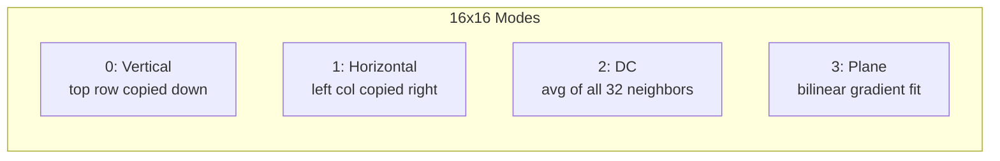

# Intra Prediction

Generates prediction blocks for intra-coded macroblocks from already-decoded
neighboring pixels. Intra prediction is the only prediction available in
I-frames and also appears within P/B-frames for intra-coded MBs.

**H.264 Spec:** Sections 8.3.1 (4x4), 8.3.2 (8x8), 8.3.3 (16x16), 8.3.4 (Chroma)

## Reference Sample Layout

All intra modes predict from previously reconstructed neighbors around the
current block. The naming convention for a 4x4 block:

```
              top_left   top (A-D)     top_right (E-H)
                M    A  B  C  D    E  F  G  H
        left  I [  predicted  ]
        (I-L) J [   4x4      ]
              K [   block     ]
              L [             ]
```

For 8x8 (High Profile), the layout scales to 25 samples: 8 top (A0-A7),
8 top-right (B0-B7), 8 left (I0-I7), and 1 corner (M). For 16x16, the
full 16-pixel top and left rows are used.

When a neighbor is outside the frame or belongs to an inter MB (with
`constrained_intra_pred_flag`), it is **unavailable**. DC mode falls back
to the available side or defaults to 128 (midpoint of 8-bit range).
For 8x8, unavailable top samples are substituted from `left[0]` before
the lowpass filter is applied.

## The Nine 4x4 / 8x8 Prediction Modes

```
    Mode 0     Mode 1      Mode 2      Mode 3      Mode 4
   Vertical  Horizontal     DC      Diag Down-L  Diag Down-R

    A B C D                          \             /
    | | | |   I---->       avg       A \          / A
    | | | |   J---->      (all       B  \        /  B
    | | | |   K---->    neighbors)   C   \      /   C
    | | | |   L---->                 D    v    v    D

    Mode 5      Mode 6      Mode 7       Mode 8
  Vert-Right  Horiz-Down   Vert-Left   Horiz-Up

     |/         --/          |\
     |/        I--/          |\          I--\
     |/        J--/          |\          J--\
     |/        K--/          |\          K--\
    26.6deg    26.6deg      26.6deg     26.6deg
```

Each directional mode extrapolates from neighbors at a specific angle.
The formula uses weighted averages of 2 or 3 reference samples:
- `avg2(a, b) = (a + b + 1) >> 1` (half-pel positions)
- `avg3(a, b, c) = (a + 2b + c + 2) >> 2` (filtered positions)

## I_16x16 Modes

Four simpler modes applied to the full 16x16 luma block:



The **Plane** mode computes horizontal (H) and vertical (V) gradients from
the neighbors, then fills the block with a tilted plane:

```
pred[y,x] = Clip((a + b*(x-7) + c*(y-7) + 16) >> 5)

a = 16 * (top[15] + left[15])
b = (5*H + 32) >> 6     H = sum_{i=0..7} (i+1)*(top[8+i] - top[6-i])
c = (5*V + 32) >> 6     V = sum_{i=0..7} (i+1)*(left[8+i] - left[6-i])
```

## Chroma Prediction

Chroma blocks (8x8 in 4:2:0) use 4 modes numbered differently from luma:
0=DC, 1=Horizontal, 2=Vertical, 3=Plane. The same formulas apply at the
chroma block size.

## 8x8 Reference Sample Filtering (High Profile)

Before Intra_8x8 prediction, the 25 reference samples pass through a
3-tap lowpass filter to reduce blocking artifacts:

```
Before filtering:   M   A0  A1  A2 ... A7   B0 ... B7
                    I0
                    I1
                    ...
                    I7

Filter:  p'[i] = (p[i-1] + 2*p[i] + p[i+1] + 2) >> 2

After:   M'  A0' A1' A2' ... A7'  B0' ... B7'
         I0'
         I1'
         ...
         I7'
```

This filtering is unique to 8x8 and critical for pixel-exact output.
When top is unavailable but left is available, substitution (`top = left[0]`)
happens **before** filtering, and the filter runs on the replicated values.

## Pipeline Position

```
parameters --> [intra] --> reconstruct --> deblock
```

## Key Files

| File | Purpose |
|------|---------|
| `intra_4x4.py` | 9 modes, neighbor availability, `predict_intra_4x4()` entry point |
| `intra_8x8.py` | 9 modes for High Profile, `lowpass_filter_8x8()`, `predict_intra_8x8()` |
| `intra_16x16.py` | 4 modes (V/H/DC/Plane), `get_neighbors_for_macroblock()` |
| `chroma_pred.py` | Chroma mode helpers, DC for 4:2:2, Plane for 4:4:4 |
| `i_pcm.py` | I_PCM parsing (mb_type 25): raw 256+128 samples, `IMBType` |

## Usage

```python
from intra.intra_4x4 import predict_intra_4x4, Intra4x4Mode
import numpy as np

top = np.array([120, 122, 125, 128], dtype=np.uint8)
left = np.array([115, 118, 120, 122], dtype=np.uint8)

# DC prediction -- averages all 8 neighbors
pred = predict_intra_4x4(mode=Intra4x4Mode.DC, top=top, left=left,
                         top_available=True, left_available=True)
# pred shape: (4, 4), dtype: uint8
```

## Spec Compliance Notes

- **HU formula:** `zHU = x + 2*y`, not `y + 2*x` (Section 8.3.2.2.9).
- **HD/VR for zHD < -1:** indices are `x-2y-3, x-2y-2, x-2y-1`, referencing corner pixel M at index -1.
- **8x8 substitution before filtering:** when top is unavailable, `top = left[0]` and `top_left = left[0]` must be set before the lowpass filter runs on those replicated values.
- **Scaling lists default:** when both SPS and PPS scaling flags are 0, use flat matrices (all 16s), not Default_8x8_Intra.
