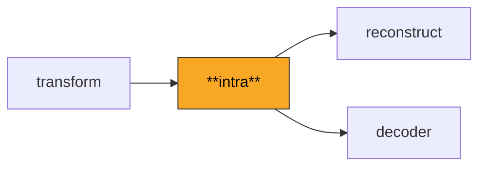
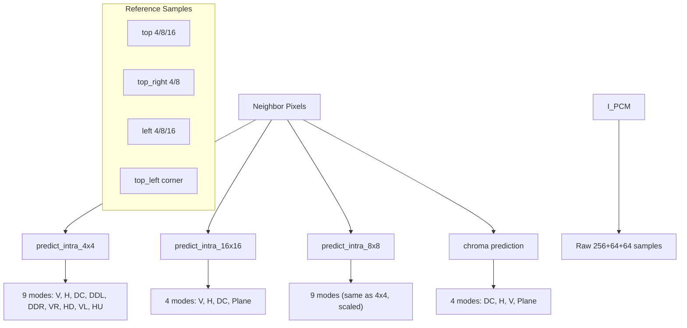

# Intra

Generates prediction blocks for intra-coded macroblocks using already-decoded neighboring pixels. Supports all nine 4x4 and 8x8 luma prediction modes, four 16x16 luma modes, four chroma modes, and I_PCM raw sample macroblocks.

**H.264 Spec Reference:** Section 8.3.1 (Intra_4x4), Section 8.3.1.3 (Intra_8x8), Section 8.3.3 (Intra_16x16), Section 8.3.4 (Chroma prediction)

## What It Does

Intra prediction exploits spatial redundancy within a single frame. For each block, the decoder generates a prediction from previously-reconstructed neighboring pixels (left, top, top-right, and top-left), then adds the decoded residual to produce the final reconstructed pixels. This is the only prediction mode available in I-frames and is also used for intra-coded macroblocks within P- and B-frames.

For 4x4 blocks, nine directional and DC modes are available. Each mode extracts up to 13 reference samples (4 top, 4 top-right, 4 left, and 1 corner) and applies directional extrapolation at angles like vertical (0 degrees), horizontal (90 degrees), or diagonals (45 degrees). The DC mode averages all available neighbors. The 8x8 variant (High profile) uses the same nine modes scaled to 25 reference samples (8 top, 8 top-right, 8 left, 1 corner) with additional low-pass filtering of the reference samples.

For 16x16 blocks, four simpler modes are available: vertical, horizontal, DC, and plane. The plane mode performs a bi-linear interpolation that works well for smooth gradients. Chroma prediction uses the same four modes applied to the 8x8 chroma blocks (in 4:2:0).

## Pipeline Position



## Architecture



## Key Files

| File | Lines | Description |
|------|-------|-------------|
| `intra_4x4.py` | 489 | All nine Intra_4x4 prediction modes with neighbor availability handling and directional interpolation |
| `intra_8x8.py` | 701 | All nine Intra_8x8 prediction modes for High profile, including low-pass reference sample filtering |
| `intra_16x16.py` | 354 | Four Intra_16x16 modes: vertical, horizontal, DC, and plane (bi-linear gradient) |
| `i_pcm.py` | 164 | I_PCM macroblock type parsing and `IMBType` dataclass: maps mb_type codes 0-25 to prediction parameters |
| `chroma_pred.py` | 59 | Chroma prediction helpers: supported modes per chroma format, DC prediction for 4:2:2, plane for 4:4:4 |

## Key Concepts

**Neighbor Availability.** A neighbor is unavailable if it is outside the frame boundary or (with `constrained_intra_pred_flag`) belongs to an inter-coded macroblock. When neighbors are unavailable, the DC mode falls back to using only the available side, or defaults to 128 if none are available.

**Directional Modes.** Each mode extrapolates at a specific angle. For example, Diagonal Down-Left (mode 3) at position `(y, x)` averages `top[x+y]`, `top[x+y+1]`, and `top[x+y+2]`, projecting samples along a 45-degree line from the top-right. Vertical-Right (mode 5) projects at approximately 26.6 degrees right of vertical.

**I_16x16 Plane Mode.** The plane mode computes gradients H and V from the 16x16 neighbors:
```
H = sum_{x=0..7} (x+1) * (top[8+x] - top[6-x])
V = sum_{y=0..7} (y+1) * (left[8+y] - left[6-y])
a = 16 * (top[15] + left[15])
b = (5*H + 32) >> 6
c = (5*V + 32) >> 6
pred[y,x] = Clip1((a + b*(x-7) + c*(y-7) + 16) >> 5)
```

**8x8 Reference Sample Filtering.** Before Intra_8x8 prediction, the 25 reference samples undergo low-pass filtering: `p'[i] = (p[i-1] + 2*p[i] + p[i+1] + 2) >> 2`. When top is unavailable but left is available, the top samples are substituted from `left[0]` before filtering. This filtering is unique to 8x8 and critical for pixel-exact output.

**I_PCM.** Macroblock type 25 bypasses all prediction and transform. It contains 256 raw luma samples plus 64+64 chroma samples (in 4:2:0), read directly from the bitstream.

## Example

```python
from intra import predict_intra_4x4, Intra4x4Mode
import numpy as np

top = np.array([120, 122, 125, 128], dtype=np.uint8)
left = np.array([115, 118, 120, 122], dtype=np.uint8)
top_left = np.uint8(118)

pred = predict_intra_4x4(
    mode=Intra4x4Mode.DC,
    top=top, left=left, top_left=top_left,
    top_available=True, left_available=True,
)
# pred is a (4, 4) uint8 array
```

## Spec Compliance Notes

- For Intra_8x8, the Horizontal-Up (HU) prediction formula uses `zHU = x + 2*y`, not `y + 2*x`. The Horizontal-Down (HD) and Vertical-Right (VR) formulas for `zHD < -1` / `zVR < -1` use offsets `x-2y-3, x-2y-2, x-2y-1` referencing the corner pixel M at index -1.
- When top neighbors are unavailable but left neighbors are available for Intra_8x8, the substitution `top = left[0]` and `top_left = left[0]` must happen before the low-pass filter, and the filter must be applied to the replicated values (not skipped).
- The default pixel value of 128 is used when no neighbors are available for DC prediction, following the convention that 128 is the midpoint of the 8-bit range.
