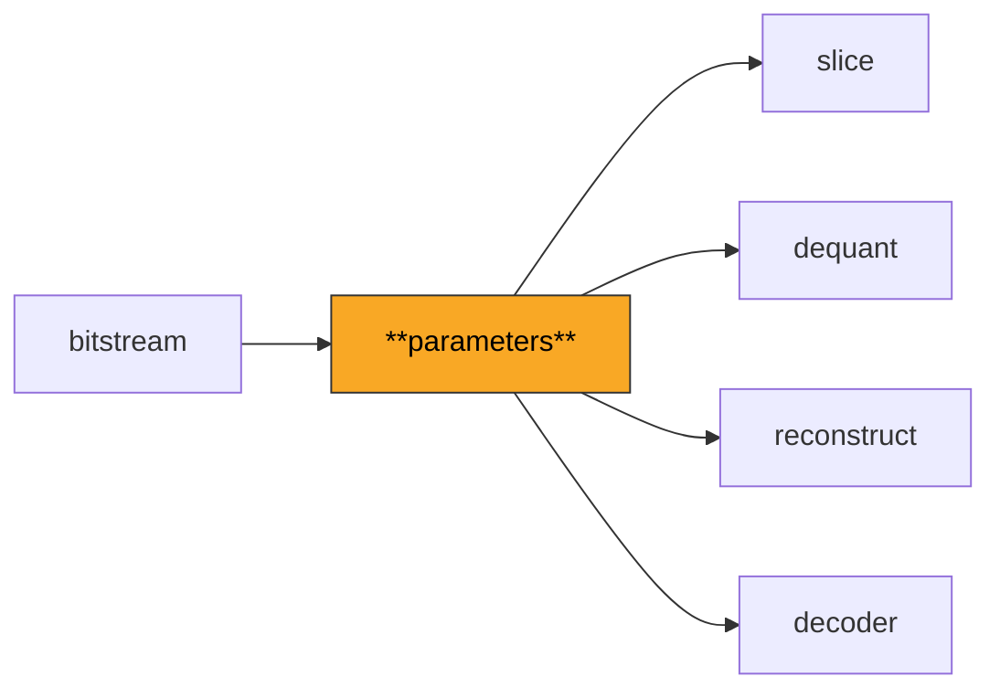
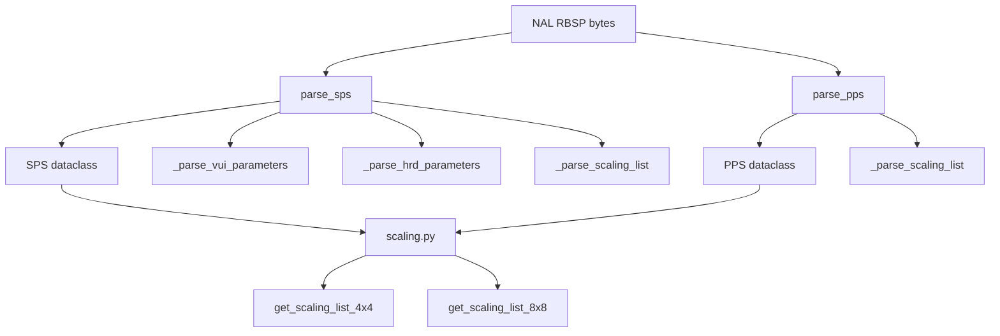

# Parameters

Parses the Sequence Parameter Set (SPS) and Picture Parameter Set (PPS), which define the global configuration for an H.264 video stream -- dimensions, profile, quantization defaults, and scaling matrices.

**H.264 Spec Reference:** Section 7.3.2 (Parameter set syntax), Section 7.4.2 (Parameter set semantics), Annex A (Profiles and levels)

## What It Does

Before any video frame can be decoded, the decoder must know the video's dimensions, chroma format, bit depth, maximum number of reference frames, and many other configuration values. These are carried in two types of parameter sets that are transmitted ahead of the slice data.

The SPS contains sequence-level information: profile and level (which constrain the bitstream features and complexity), picture dimensions in macroblocks, frame numbering parameters for reference management, picture order count (POC) configuration for display ordering, and optionally VUI timing information for frame rate. High profile streams additionally carry chroma format, bit depth, and scaling matrix flags.

The PPS contains picture-level information: entropy coding mode (CAVLC or CABAC), default reference picture counts, weighted prediction flags, initial QP, deblocking filter control, and for High profile, the `transform_8x8_mode_flag` and custom scaling matrices. Multiple PPS can reference the same SPS, allowing per-picture configuration changes without retransmitting sequence-level data.

## Pipeline Position



## Architecture



## Key Files

| File | Lines | Description |
|------|-------|-------------|
| `sps.py` | 572 | SPS parsing: profile/level, dimensions, POC config, VUI/HRD parameters, frame cropping |
| `pps.py` | 291 | PPS parsing: entropy mode, QP defaults, weighted prediction, deblocking, FMO slice groups |
| `scaling.py` | 391 | Scaling list resolution: default/flat/custom lists, SPS/PPS fallback chains for 4x4 and 8x8 |

## Key Concepts

**Profiles and Levels.** The `profile_idc` field determines which coding tools are available. Baseline (66) uses CAVLC only with no B-frames. Main (77) adds CABAC and B-frames. High (100) adds 8x8 transforms and custom scaling matrices. The `level_idc` constrains resolution, bitrate, and DPB size.

**Derived Dimensions.** Raw dimensions are stored as `pic_width_in_mbs_minus1` and `pic_height_in_map_units_minus1`. Actual pixel dimensions require accounting for `frame_mbs_only_flag` and frame cropping offsets. The `SPS` dataclass provides computed properties like `cropped_width` and `cropped_height`.

**Scaling Lists.** High profile supports custom quantization matrices at SPS and PPS levels. Resolution follows a fallback chain: PPS overrides SPS, absent lists fall back to the previous list of the same type (intra/inter), and when neither SPS nor PPS signals a scaling matrix, flat lists (all 16s) are used.

**Picture Order Count.** Three POC types exist. Type 0 (most common) uses an explicit `pic_order_cnt_lsb` with MSB wraparound tracking. Type 2 derives POC directly from `frame_num`. The `max_pic_order_cnt_lsb` property computes the wraparound period from `log2_max_pic_order_cnt_lsb_minus4`.

**Chroma QP Offset.** The PPS carries `chroma_qp_index_offset` (and `second_chroma_qp_index_offset` in High profile) that shift the luma QP before looking up the chroma QP from the nonlinear mapping table.

## Example

```python
from bitstream import extract_nal_units, NALUnitType
from parameters import parse_sps, parse_pps

nals = extract_nal_units(bitstream_data)
sps_nal = next(n for n in nals if n.nal_unit_type == NALUnitType.SPS)
pps_nal = next(n for n in nals if n.nal_unit_type == NALUnitType.PPS)

sps = parse_sps(sps_nal.rbsp)
print(f"{sps.profile_name} @ Level {sps.level}")
print(f"Resolution: {sps.cropped_width}x{sps.cropped_height}")

is_high = sps.profile_idc >= 100
pps = parse_pps(pps_nal.rbsp, is_high_profile=is_high)
print(f"Entropy: {pps.entropy_coding_mode}, Init QP: {pps.pic_init_qp}")
```

## Spec Compliance Notes

- When `seq_scaling_matrix_present_flag=0` and `pic_scaling_matrix_present_flag=0`, flat scaling lists (all 16s) are used rather than the spec default tables. This matches the JM reference decoder's `assign_quant_params` behavior and is a common source of pixel-mismatch bugs.
- VUI HRD parameters are parsed and consumed to advance the bit position correctly, but not stored, since they are only needed for HRD conformance checking rather than pixel reconstruction.
- The `second_chroma_qp_index_offset` defaults to `chroma_qp_index_offset` when not explicitly present in the PPS, matching Section 7.4.2.2 semantics.
