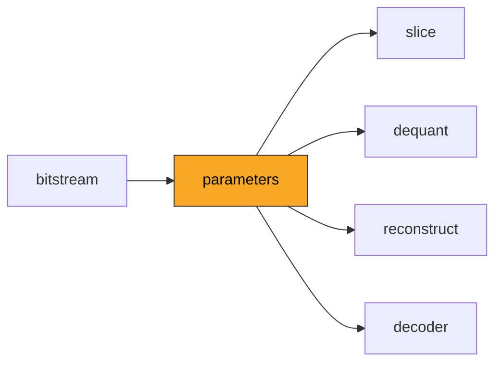
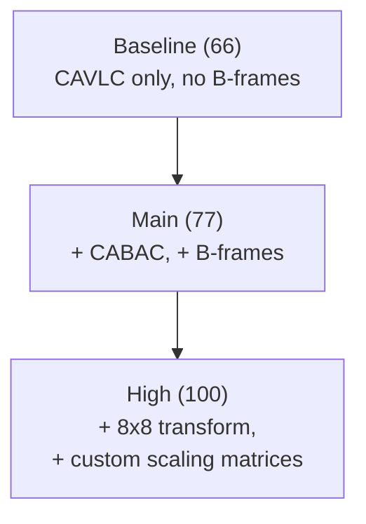
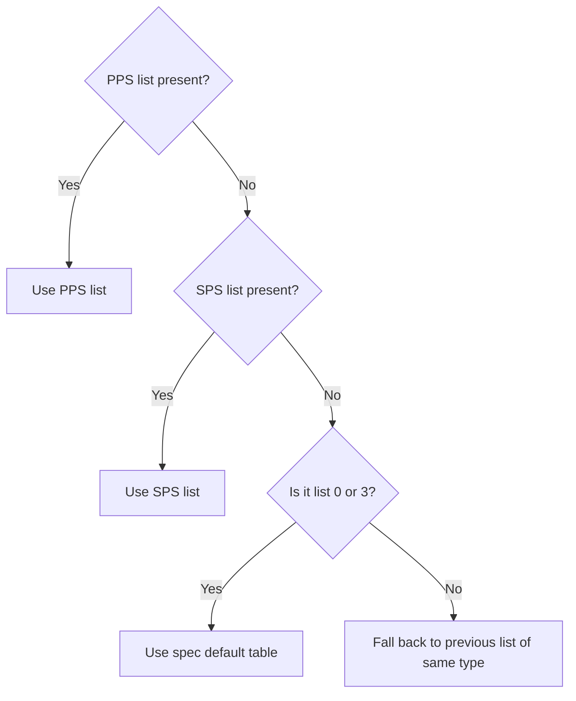

# Parameters

Parses the Sequence Parameter Set (SPS) and Picture Parameter Set (PPS), which
define the global configuration for an H.264 video stream -- dimensions,
profile, quantization defaults, and scaling matrices.

**H.264 Spec Reference:** Section 7.3.2 (Parameter set syntax), Section 7.4.2
(Parameter set semantics), Annex A (Profiles and levels)

## Pipeline Position



## SPS Structure

The SPS is transmitted once per sequence and configures the decoder globally.
Every field below is parsed from the RBSP in this order (Section 7.3.2.1):

```
 SPS RBSP layout (Baseline/Main):
 +----------+--------+-------+--------+---------+----------+-----+-----+
 |profile   |constr. |level  |sps_id  |log2_max |poc_type  |ref  |dims |...
 |_idc (8b) |flags   |_idc   |ue(v)   |frame_num|+ params  |frame|in   |
 |          |(6b+2r) |(8b)   |        |ue(v)    |ue(v)     |ue(v)|MBs  |
 +----------+--------+-------+--------+---------+----------+-----+-----+
```

### Concrete Example: 352x288 Main Profile SPS

```
Field                              Bits    Value    Meaning
-------------------------------------------------------------------
profile_idc                        u(8)    77       Main Profile
constraint_set0..5_flag            6 bits  010000   set1=1 (Main-compatible)
reserved_zero_2bits                u(2)    0
level_idc                          u(8)    30       Level 3.0
seq_parameter_set_id               ue(v)   0        SPS #0
log2_max_frame_num_minus4          ue(v)   0        max_frame_num = 16
pic_order_cnt_type                 ue(v)   0        POC type 0
log2_max_pic_order_cnt_lsb_minus4  ue(v)   2        max_poc_lsb = 64
max_num_ref_frames                 ue(v)   1        1 reference frame
gaps_in_frame_num_allowed          u(1)    0
pic_width_in_mbs_minus1            ue(v)   21       22 MBs = 352 px
pic_height_in_map_units_minus1     ue(v)   17       18 MBs = 288 px
frame_mbs_only_flag                u(1)    1        progressive
direct_8x8_inference_flag          u(1)    1
frame_cropping_flag                u(1)    0        no cropping
vui_parameters_present_flag        u(1)    1        VUI present
```

The `SPS` dataclass exposes derived properties: `cropped_width`,
`cropped_height`, `max_frame_num`, `max_pic_order_cnt_lsb`, and `profile_name`.

### Profiles and Levels



The `level_idc` constrains resolution, bitrate, and DPB size. For example,
Level 3.1 (level_idc=31) allows up to 1280x720 at 30fps.

### Picture Order Count

Three POC types control display ordering:

```
Type 0 (most common): explicit pic_order_cnt_lsb with MSB wraparound
  POC = PicOrderCntMsb + pic_order_cnt_lsb
  Wraparound period = 2^(log2_max_pic_order_cnt_lsb_minus4 + 4)

Type 2: POC derived from frame_num (I/P-only streams)
  POC = 2 * frame_num  (non-reference: 2*frame_num - 1)
```

## PPS Structure

The PPS configures per-picture decoding. Multiple PPS can reference the same
SPS, allowing configuration changes mid-stream without retransmitting
sequence-level data.

```
 PPS RBSP layout:
 +------+------+-------+------+--------+------+------+------+------+-----+
 |pps_id|sps_id|entropy|bottom|slice   |ref   |weight|QP    |chroma|flags|
 |ue(v) |ue(v) |mode   |field |groups  |counts|pred  |params|qp_off|     |
 |      |      |u(1)   |u(1)  |ue(v)   |ue+ue |u1+u2 |se*3  |      |     |
 +------+------+-------+------+--------+------+------+------+------+-----+
```

### Key PPS Fields

| Field | Type | Effect on Decoder |
|-------|------|-------------------|
| `entropy_coding_mode_flag` | u(1) | 0=CAVLC, 1=CABAC. Selects the entropy decoder. |
| `weighted_pred_flag` | u(1) | Enables weighted prediction for P-slices. |
| `weighted_bipred_idc` | u(2) | 0=default, 1=explicit, 2=implicit weighted bipred. |
| `pic_init_qp_minus26` | se(v) | Initial QP = 26 + this offset. |
| `chroma_qp_index_offset` | se(v) | Shifts luma QP before chroma QP table lookup. |
| `deblocking_filter_control_present_flag` | u(1) | Enables per-slice deblocking parameters. |
| `transform_8x8_mode_flag` | u(1) | High profile only. Enables 8x8 integer transform. |

## Scaling Lists

High Profile supports custom quantization matrices at both SPS and PPS levels.
There are six 4x4 lists and two 8x8 lists:

```
 4x4 lists (16 values each):        8x8 lists (64 values each):
 +-------+-------+-------+          +-------+-------+
 | 0: Y  | 1: Y  | 2: Y  |  Intra  | 0 (6) | Intra |
 | Intra | Intra | Intra |          +-------+-------+
 +-------+-------+-------+          | 1 (7) | Inter |
 | 3: Y  | 4: Y  | 5: Y  |  Inter  +-------+-------+
 | Inter | Inter | Inter |
 +-------+-------+-------+
```

### Fallback Chain

When a list is absent, the decoder applies fallback rules:



When neither SPS nor PPS signals a scaling matrix
(`seq_scaling_matrix_present_flag=0` and `pic_scaling_matrix_present_flag=0`),
flat lists (all 16s) are used. This matches the JM reference decoder and is a
common source of pixel-mismatch bugs -- the spec default tables are only used
as fallback when the flag is 1 but a specific list is absent.

## Architecture


## Key Files

| File | Description |
|------|-------------|
| `sps.py` | SPS parsing: profile/level, dimensions, POC config, VUI/HRD parameters, frame cropping |
| `pps.py` | PPS parsing: entropy mode, QP defaults, weighted prediction, deblocking, FMO slice groups |
| `scaling.py` | Scaling list resolution: default/flat/custom lists, SPS/PPS fallback chains for 4x4 and 8x8 |

## API Reference

```python
# --- SPS ---
sps = parse_sps(rbsp_bytes)
sps.profile_idc          # 66, 77, 100, ...
sps.cropped_width         # pixel width after cropping
sps.cropped_height        # pixel height after cropping
sps.max_frame_num         # 2^(log2_max_frame_num_minus4 + 4)
sps.max_pic_order_cnt_lsb # wraparound period for POC type 0

# --- PPS ---
pps = parse_pps(rbsp_bytes, is_high_profile=True)
pps.entropy_coding_mode   # "CAVLC" or "CABAC"
pps.pic_init_qp           # 26 + pic_init_qp_minus26
pps.weighted_bipred_mode  # "Default", "Explicit", or "Implicit"

# --- Scaling lists ---
get_scaling_list_4x4(sps, pps, index)  # 16 values, index 0-5
get_scaling_list_8x8(sps, pps, index)  # 64 values, index 0-1
```

## Usage Example

```python
from bitstream import extract_nal_units, NALUnitType
from parameters import parse_sps, parse_pps

nals = extract_nal_units(bitstream_data)
sps_nal = next(n for n in nals if n.nal_unit_type == NALUnitType.SPS)
pps_nal = next(n for n in nals if n.nal_unit_type == NALUnitType.PPS)

sps = parse_sps(sps_nal.rbsp)
print(f"{sps.profile_name} @ Level {sps.level}")
print(f"Resolution: {sps.cropped_width}x{sps.cropped_height}")

pps = parse_pps(pps_nal.rbsp, is_high_profile=(sps.profile_idc >= 100))
print(f"Entropy: {pps.entropy_coding_mode}, Init QP: {pps.pic_init_qp}")
```

## Spec Compliance Notes

- When `seq_scaling_matrix_present_flag=0` and
  `pic_scaling_matrix_present_flag=0`, flat scaling lists (all 16s) are used
  rather than the spec default tables. This matches JM `assign_quant_params`.
- VUI HRD parameters are parsed to advance the bit position correctly but not
  stored, since they are only needed for HRD conformance checking.
- `second_chroma_qp_index_offset` defaults to `chroma_qp_index_offset` when
  not explicitly present in the PPS, matching Section 7.4.2.2 semantics.
