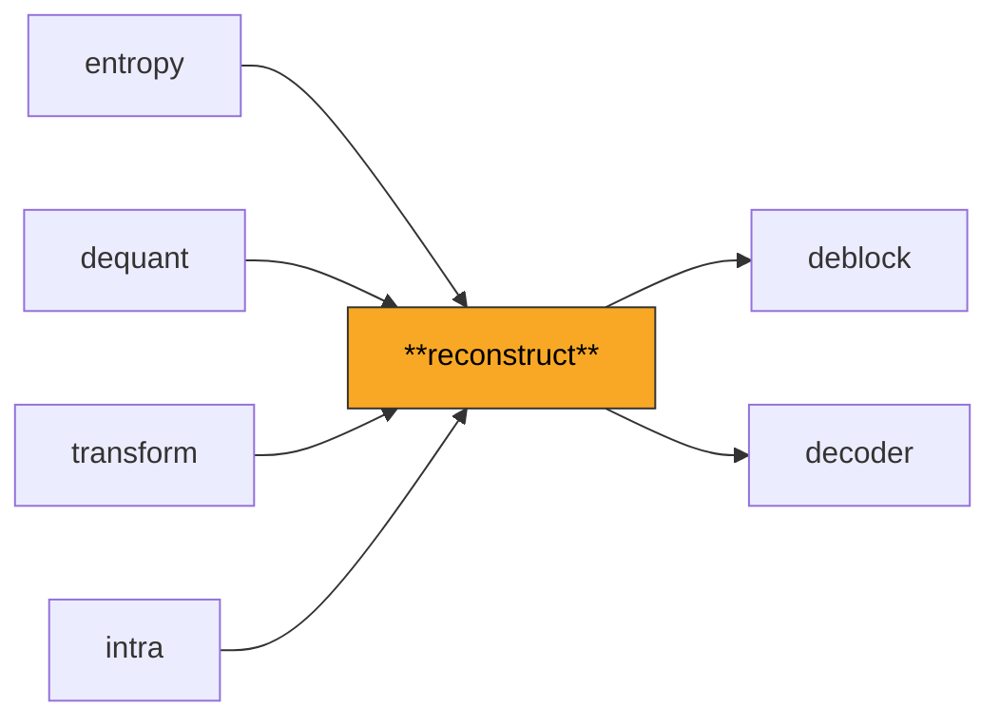
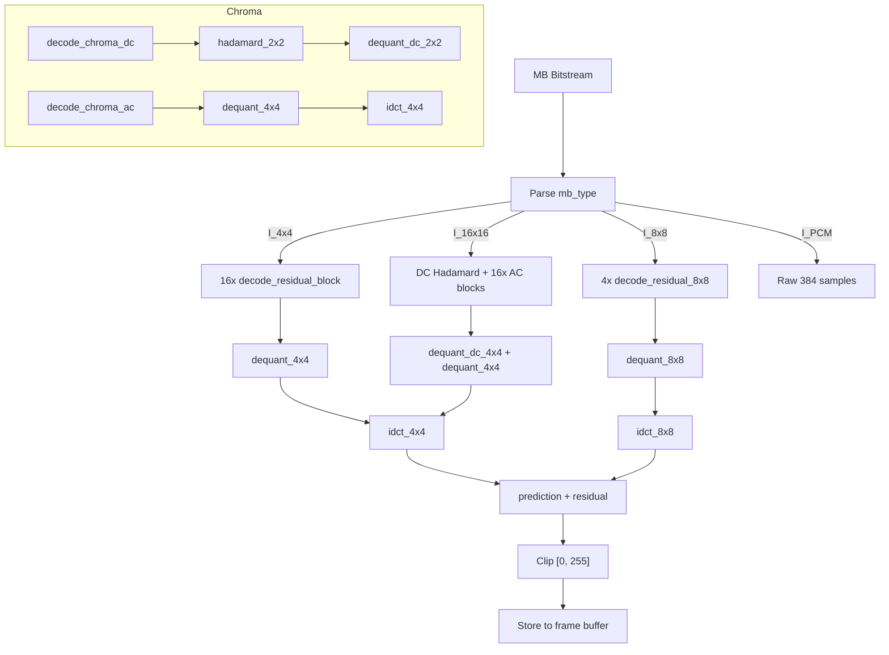

# Reconstruct

Orchestrates the macroblock-level reconstruction pipeline for I-slices: combines entropy decoding, dequantization, inverse transform, and intra prediction to produce final pixel values. Manages the macroblock decoding state machine and non-zero coefficient tracking.

**H.264 Spec Reference:** Section 7.3.5 (Macroblock layer syntax), Section 8.3 (Intra prediction), Section 8.5 (Transform coefficient decoding)

## What It Does

This module ties together the lower-level modules (entropy, dequant, transform, intra) into the macroblock reconstruction pipeline that the main decoder calls for each I-coded macroblock. It handles the complete data flow from bitstream to pixels.

For an I_4x4 macroblock, the pipeline processes 16 blocks in raster scan order. For each 4x4 block: read the prediction mode, fetch neighbor pixels from already-reconstructed blocks, generate the intra prediction, decode residual coefficients via CAVLC, dequantize, apply the inverse transform, and add the residual to the prediction. The result is clipped to [0, 255] and stored. Chroma is processed similarly with 2x2 DC Hadamard, 4 Cb blocks, and 4 Cr blocks.

For an I_16x16 macroblock, the luma DC coefficients from all 16 blocks are collected, Hadamard-transformed, dequantized together, then distributed back to each block before the per-block IDCT. For I_8x8 (High profile), the pipeline operates on 4 blocks of 8x8 each, using the 8x8 inverse transform and optional scaling lists.

The module also provides a state machine (`MacroblockDecoder` in `mb_state.py`) that tracks the decoding progress through the prescribed order: START_MB, LUMA_RESIDUAL, CHROMA_DC, CHROMA_AC, MB_COMPLETE.

## Pipeline Position



## Architecture



## Key Files

| File | Lines | Description |
|------|-------|-------------|
| `macroblock.py` | 2337 | Core reconstruction: `decode_macroblock` for I_4x4/I_16x16/I_8x8, CBP parsing, chroma DC/AC decoding, neighbor nC lookup, block scan order |
| `mb_state.py` | 335 | Macroblock decoding state machine: `MBState` enum (START_MB through MB_COMPLETE), `MacroblockDecoder` class, validation with detailed error context |

## Key Concepts

**Coded Block Pattern (CBP).** A compact representation of which blocks contain non-zero coefficients. The 4-bit luma CBP indicates which of the four 8x8 regions have coefficients (each bit covers four 4x4 blocks). The 2-bit chroma CBP: 0=none, 1=DC only, 2=DC+AC.

**Block Scan Order.** The 16 blocks within a macroblock are processed in a specific raster-within-8x8 order: blocks 0-3 in the top-left 8x8, blocks 4-7 in the top-right 8x8, blocks 8-11 in the bottom-left 8x8, blocks 12-15 in the bottom-right 8x8. The `BLOCK_SCAN_ORDER` table maps linear block index to (row, col) within the macroblock.

**Neighbor nC Lookup.** CAVLC table selection requires the non-zero coefficient count from the left and top neighboring 4x4 blocks. The `get_luma_neighbor_nz` function handles cross-macroblock lookups, returning `nA` (left) and `nB` (above) for `calculate_nC`.

**I_16x16 DC Pipeline.** For I_16x16 macroblocks, the DC coefficients of all 16 blocks are extracted, arranged in a 4x4 matrix, Hadamard-transformed, dequantized with DC-specific scaling, then placed back into each block's [0,0] position before the per-block IDCT processes the AC coefficients.

**Reconstruction Formula.** For each pixel position:
```
reconstructed[y, x] = Clip1(prediction[y, x] + residual[y, x])
```
where `Clip1` clamps to [0, 255] for 8-bit depth. Computation uses `int32` throughout to prevent overflow; the final clip-and-cast to `uint8` happens only at the output.

## Example

```python
from reconstruct import decode_macroblock, MacroblockData
from bitstream import BitReader
from parameters import SPS, PPS

reader = BitReader(mb_rbsp_data)
mb_data = decode_macroblock(
    reader=reader,
    sps=sps, pps=pps,
    mb_x=5, mb_y=3,
    frame_luma=frame_luma, frame_cb=frame_cb, frame_cr=frame_cr,
    frame_nz_counts=nz_count_array,
    slice_qp=28,
)
# mb_data.luma is (16, 16) uint8
# mb_data.cb, mb_data.cr are (8, 8) uint8
```

## Spec Compliance Notes

- CBP and residual data must be consumed for ALL inter MB types, not just intra MBs. Failing to read the residual for inter MBs with non-zero CBP causes the bitstream position to desynchronize.
- The nz_counts array must be updated for intra MBs in P/B-slices, along with QP and MV cache marking. Missing any of these causes incorrect neighbor context for subsequent macroblocks.
- All arithmetic during reconstruction uses `int32` to prevent overflow. The `uint8` clip only happens at the final pixel output, following NumPy patterns documented in the project conventions.
