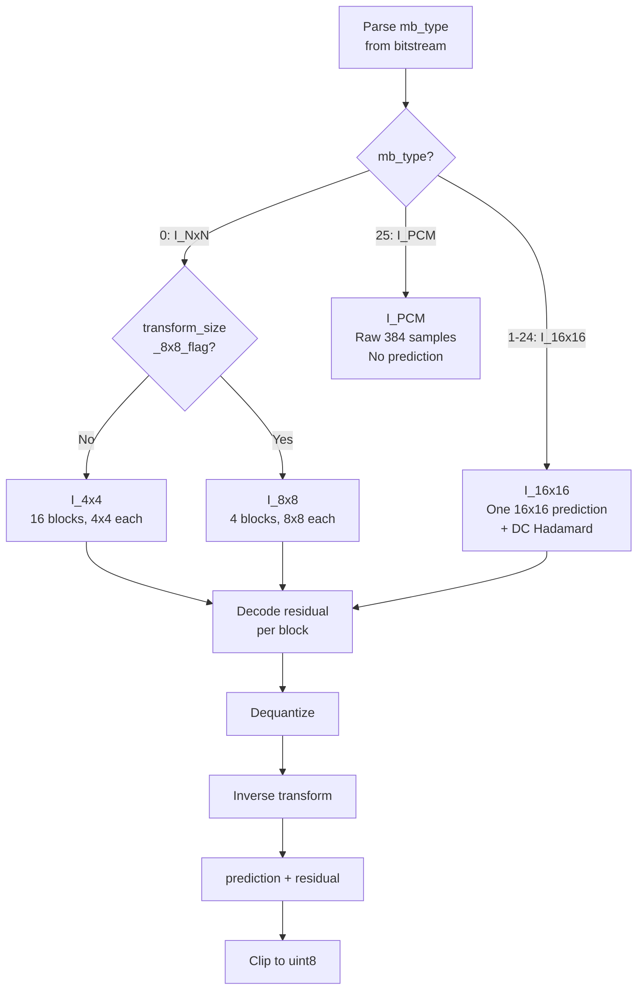
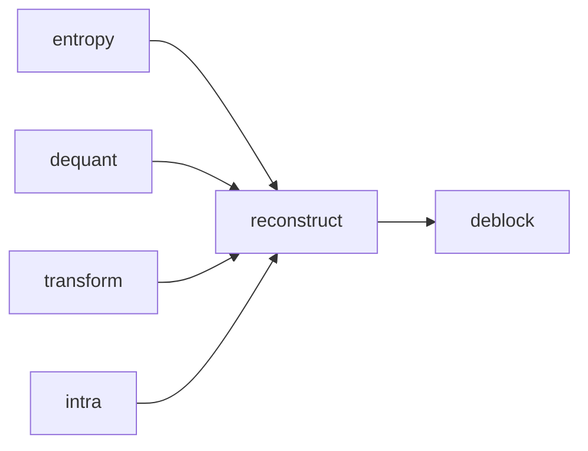

# Reconstruct

Orchestrates macroblock-level reconstruction for I-slices: combines prediction,
entropy decoding, dequantization, and inverse transform to produce final pixel
values.

**H.264 Spec Reference:** Section 7.3.5 (MB syntax), Section 8.3 (Intra prediction), Section 8.5 (Transform decoding)

## Core Formula

Every reconstructed pixel follows the same equation:

```
reconstructed[y, x] = Clip1( prediction[y, x] + residual[y, x] )

where Clip1 clamps to [0, 255] for 8-bit depth
```

Prediction comes from intra modes (neighbor-based). Residual comes from the
entropy -> dequant -> inverse transform pipeline. All arithmetic uses int32
to prevent overflow; the uint8 cast happens only at final output.

## Macroblock Type Routing



## Block Scan Order

The 16 luma 4x4 blocks within a macroblock are processed in raster-within-8x8
order. Each digit below shows the block index at that 4x4 position:

```
+----+----+----+----+
|  0 |  1 |  4 |  5 |   8x8 block 0 (top-left):     blocks 0,1,2,3
+----+----+----+----+
|  2 |  3 |  6 |  7 |   8x8 block 1 (top-right):    blocks 4,5,6,7
+----+----+----+----+
|  8 |  9 | 12 | 13 |   8x8 block 2 (bottom-left):  blocks 8,9,10,11
+----+----+----+----+
| 10 | 11 | 14 | 15 |   8x8 block 3 (bottom-right): blocks 12,13,14,15
+----+----+----+----+
```

## Coded Block Pattern (CBP)

CBP is a compact signal indicating which blocks carry non-zero coefficients,
allowing the decoder to skip empty blocks entirely.

```
Luma CBP (4 bits):               Chroma CBP (2 bits):
  bit 0 = 8x8 block 0             0 = no chroma coefficients
  bit 1 = 8x8 block 1             1 = DC only (Cb + Cr)
  bit 2 = 8x8 block 2             2 = DC + AC
  bit 3 = 8x8 block 3

Example: luma CBP = 0b1001 means blocks 0 and 3 have coefficients,
         blocks 1 and 2 are all-zero (skip dequant/IDCT).
```

For I_16x16, CBP is encoded directly in mb_type (types 1-24 encode prediction
mode, chroma CBP, and whether luma has any AC coefficients).

## QP Delta

Each macroblock adjusts QP via `mb_qp = previous_mb_qp + mb_qp_delta`. QP
affects dequantization scaling and must be tracked accurately -- a wrong QP
compounds through inter prediction.

## Non-Zero Coefficient Counts (nC)

CAVLC table selection depends on the non-zero coefficient count from neighboring
blocks. For each 4x4 block, nC is derived from left (nA) and above (nB) neighbors:

```
nC = (nA + nB + 1) >> 1    if both available
nC = nA or nB              if only one available
nC = 0                     if neither available
```

The `nz_counts` array (24 entries: 16 luma + 4 Cb + 4 Cr) is stored per
macroblock and used by neighbors in subsequent macroblocks.

## I_16x16 DC Hadamard Pipeline

For I_16x16 macroblocks, the DC coefficient from each of the 16 blocks is
extracted into a 4x4 matrix, Hadamard-transformed, dequantized with DC-specific
scaling, then distributed back before per-block IDCT:

```
16 blocks --> extract DC[0,0] from each --> 4x4 matrix
--> Hadamard 4x4 --> dequant_dc --> distribute back
--> per-block IDCT on AC coefficients --> add to prediction
```

## Pipeline Position



## Key Files

| File | Description |
|------|-------------|
| `macroblock.py` | Core: `decode_macroblock` for I_4x4/I_16x16/I_8x8, CBP parsing, chroma pipeline |
| `mb_state.py` | State machine: `MBState` enum (START_MB through MB_COMPLETE), validation |

## Example

```python
from reconstruct import decode_macroblock

mb_data = decode_macroblock(
    reader=reader, sps=sps, pps=pps,
    mb_x=5, mb_y=3,
    frame_luma=frame_luma, frame_cb=frame_cb, frame_cr=frame_cr,
    frame_nz_counts=nz_count_array, slice_qp=28,
)
# mb_data.luma is (16, 16) uint8
# mb_data.cb, mb_data.cr are (8, 8) uint8
# mb_data.nz_counts has 24 entries for CAVLC context
```

## Spec Compliance Notes

- CBP and residual must be consumed for ALL inter MB types, not just intra.
- The nz_counts array must be updated for intra MBs in P/B-slices, along with
  QP and MV cache. Missing any causes incorrect neighbor context.
- All arithmetic uses int32; uint8 clip happens only at final pixel output.
