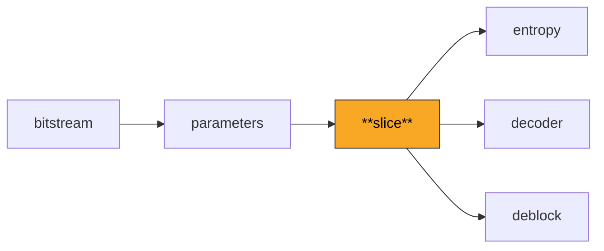
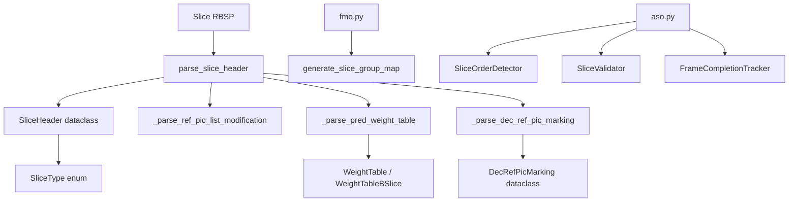

# Slice

Parses slice headers, which carry per-slice decoding parameters including slice type, QP delta, reference picture management commands, and deblocking filter settings. Also implements Flexible Macroblock Ordering (FMO) and Arbitrary Slice Ordering (ASO) support.

**H.264 Spec Reference:** Section 7.3.3 (Slice header syntax), Section 7.4.3 (Slice header semantics), Table 7-6 (Slice types)

## What It Does

A single H.264 picture is divided into one or more slices, each independently decodable. The slice header sits between the NAL header and the macroblock data, carrying critical information the decoder needs before processing any macroblocks in that slice.

The slice header identifies the slice type (I, P, B, SI, or SP), the first macroblock address, and which PPS to use. For inter slices, it contains reference picture list modification commands (reordering) and the number of active references for L0 and L1 lists. For weighted prediction, weight tables with per-reference luma and chroma weights and offsets are parsed here. Reference picture marking commands (MMCO operations) control which decoded frames remain in the DPB.

Beyond the core header, this module provides infrastructure for advanced slice features: `fmo.py` generates slice group maps for all seven FMO map types, `aso.py` tracks arbitrary slice ordering with validation, overlap detection, and frame completion tracking. These are needed for error-resilient streaming scenarios where slices may arrive out of order or with redundant copies.

## Pipeline Position



## Architecture



## Key Files

| File | Lines | Description |
|------|-------|-------------|
| `slice_header.py` | 588 | Core slice header parsing: type, frame_num, POC, ref list modification, MMCO, QP delta, deblocking params |
| `aso.py` | 391 | Arbitrary slice ordering: `SliceOrderDetector`, `SliceValidator`, `FrameCompletionTracker`, overlap detection |
| `fmo.py` | 156 | Flexible Macroblock Ordering: generates slice group maps for all 7 map types (interleaved, dispersed, foreground, etc.) |
| `pred_weight_table.py` | 75 | P-slice weighted prediction table parsing (luma and chroma weights/offsets) |

## Key Concepts

**Slice Types.** Values 0-4 map to P, B, I, SP, SI. Values 5-9 are identical but signal that all macroblocks in the slice are of that type. The `SliceType.normalize()` method maps 5-9 back to 0-4.

**Reference Picture List Modification.** For P and B slices, the default reference list ordering can be changed via `modification_of_pic_nums_idc` commands. This uses a shift-insert-compact algorithm (Section 8.2.4.3.1) -- not a simple pop/insert -- where each command shifts an entry to the front and compacts remaining entries.

**Decoded Reference Picture Marking.** IDR frames can flag `no_output_of_prior_pics_flag` and `long_term_reference_flag`. Non-IDR frames use MMCO operations (1-6) to mark short-term frames as unused, assign long-term indices, set max long-term index, or reset all references.

**Weighted Prediction.** Explicit weighted prediction encodes per-reference weights and offsets in the slice header. The formula is `pred' = ((w * pred + 2^(ld-1)) >> ld) + offset` where `ld` is `log2_weight_denom`. B-slices use separate L0 and L1 weight tables.

**Slice QP.** The actual QP for the slice is `26 + pic_init_qp_minus26 + slice_qp_delta`. Individual macroblocks can further adjust this with `mb_qp_delta`.

## Example

```python
from bitstream import BitReader
from parameters import parse_sps, parse_pps
from slice import parse_slice_header, SliceType

header = parse_slice_header(
    rbsp=slice_nal.rbsp,
    sps=sps, pps=pps,
    nal_unit_type=slice_nal.nal_unit_type,
    nal_ref_idc=slice_nal.nal_ref_idc,
)

print(f"Slice type: {header.slice_type_name}")
print(f"First MB: {header.first_mb_in_slice}")
print(f"Slice QP: {header.slice_qp}")
print(f"Deblocking: {'enabled' if header.deblocking_enabled else 'disabled'}")
```

## Spec Compliance Notes

- The `num_ref_idx_active` for both L0 and L1 must come from the slice header (either overridden or defaulting to PPS values), never from `len(ref_buffer)`. Using the buffer length instead of the signaled count is a common decoder bug.
- The `more_rbsp_data()` check is needed at the top of P/B slice macroblock loops to handle tiny NAL units that end before reaching the expected macroblock count.
- CABAC `cabac_init_idc` is only parsed for non-I slices when `entropy_coding_mode_flag` is set, per the conditional in Section 7.3.3.
