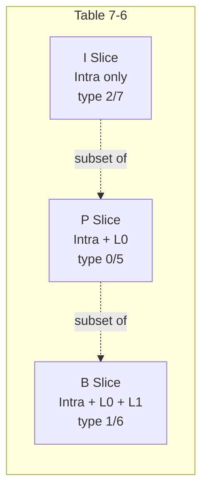
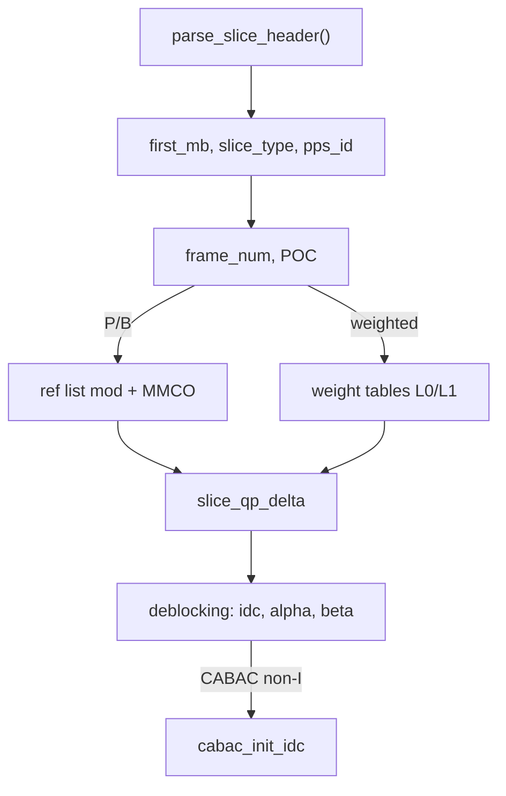

# Slice Header Parsing

Parses slice headers -- the per-slice parameters between the NAL header and
macroblock data. Every MB depends on its slice header for type, QP, reference
lists, and deblocking settings.

**H.264 Spec:** Section 7.3.3 (syntax), Section 7.4.3 (semantics)

## Pipeline Position

```
bitstream --> parameters --> [SLICE] --> entropy --> decoder
                                |                      |
                                +-------> deblock <----+
```

## Slice Types



Values 0-4 are base types; 5-9 signal all MBs share that type.
`SliceType.normalize()` maps 5-9 back to 0-4.

## Header Structure



### QP and Deblocking

```
  SliceQP = 26 + pic_init_qp_minus26 + slice_qp_delta    (PPS + header)
  MB_QP   = SliceQP + mb_qp_delta                         (per-macroblock)

  disable_deblocking_filter_idc:
      0 = enabled all edges    1 = disabled    2 = no cross-slice
  alpha_offset = slice_alpha_c0_offset_div2 * 2   (range -12..+12)
  beta_offset  = slice_beta_offset_div2 * 2       (range -12..+12)
```

## Reference Picture Management

The header controls which decoded frames serve as references for P/B slices.

```
  Default L0: short-term by descending PicNum, then long-term
  Default L1: future POC ascending, then past POC descending

  List modification (shift-insert-compact, Section 8.2.4.3.1):
      idc 0/1: shift short-term ref to front (subtract/add picNumPred)
      idc 2:   shift long-term ref to front
      idc 3:   end of loop

  MMCO (Section 8.2.5.4):
      1: mark short-term unused     4: set max long-term index
      2: mark long-term unused      5: mark all unused
      3: assign short->long-term    6: assign current as long-term
```

## Weighted Prediction

Parsed when `weighted_pred_flag` (P) or `weighted_bipred_idc==1` (B) in PPS.

```
  pred' = ((weight * pred + 2^(ld-1)) >> ld) + offset

  ld     = luma_log2_weight_denom    (typically 5-7)
  weight = per-reference             (default: 1 << ld)
  offset = per-reference             (default: 0)

  B-slices carry separate L0 and L1 tables.
  Chroma uses independent chroma_log2_weight_denom.
```

## Flexible Macroblock Ordering (FMO)

When `num_slice_groups > 1`, MBs are assigned to groups via seven map types:

```
  Type 0: Interleaved runs      Type 3: Box-out (center growth)
  Type 1: Dispersed             Type 4: Raster scan
  Type 2: Foreground rects      Type 5: Wipe (columns)
                                Type 6: Explicit per-MB

  Type 1 example, 2 groups, 4x4 frame:
      +---+---+---+---+
      | 0 | 1 | 0 | 1 |     Checkerboard pattern --
      | 1 | 0 | 1 | 0 |     each group forms an
      | 0 | 1 | 0 | 1 |     independently decodable
      | 1 | 0 | 1 | 0 |     slice for error resilience.
      +---+---+---+---+
```

## Key Files

| File | Purpose |
|------|---------|
| `slice_header.py` | Core parsing: type, frame_num, POC, ref mod, MMCO, QP, deblocking |
| `pred_weight_table.py` | P-slice weight table parsing (luma + chroma) |
| `fmo.py` | Slice group map generation for all 7 FMO types |
| `aso.py` | Arbitrary slice ordering: detection, validation, completion tracking |

## API

```python
from slice import parse_slice_header, SliceType

header = parse_slice_header(rbsp, sps, pps, nal_unit_type, nal_ref_idc)
header.slice_type_name        # "I", "P", "B"
header.slice_qp               # 26 + pps_init + delta
header.num_ref_idx_l0_active  # active L0 count
header.deblocking_enabled     # True unless idc == 1
header.header_bit_size        # bit offset to slice data

from slice.fmo import generate_slice_group_map
sgmap = generate_slice_group_map(sps, pps)  # list[int], one per MB
```

## Spec Compliance Notes

- `num_ref_idx_active` must come from slice header, never `len(ref_buffer)`.
- `more_rbsp_data()` needed at top of P/B MB loops for short NAL units.
- `cabac_init_idc` parsed only for non-I slices with `entropy_coding_mode_flag`.
- Ref list modification uses shift-insert-compact, not simple pop/insert.
