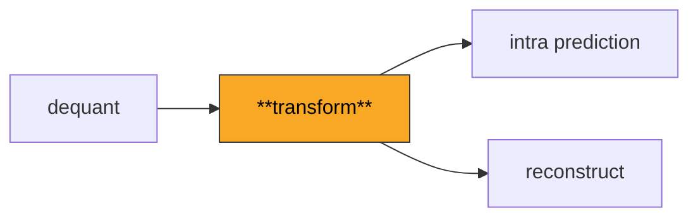
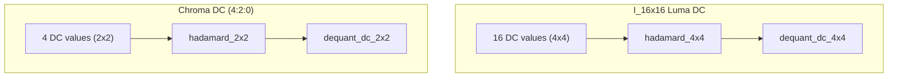

# Transform

Integer inverse transforms that convert frequency-domain coefficients back to
spatial-domain pixel residuals. Covers the 4x4 and 8x8 IDCT, plus Hadamard
transforms for DC coefficient blocks.

**H.264 Spec Reference:** Section 8.5.12 (Inverse transform process)

## Why Integer Transforms?

JPEG uses a floating-point DCT. Different CPUs produce slightly different
rounding, so two decoders can disagree by +/-1 per pixel. Over many frames
of inter prediction, those errors accumulate (**encoder-decoder drift**).
H.264 solves this with an integer-only transform that guarantees bit-exact
output on every platform. The only operations are add, subtract, and
right-shift.

## Pipeline Position



## The 4x4 Integer IDCT

The workhorse of H.264 decoding. A separable 2D transform: apply a 1D
butterfly to each column, then to each row, then normalize.

### 4-Point Butterfly

```
Input:  x[0]   x[1]   x[2]   x[3]
          |       |       |       |
         (+)     (-)    (>>1)    full     Even / Odd decomposition
          |       |       |       |
         e0     e1      o0      o1

  e0 = x[0] + x[2]       o0 = (x[1] >> 1) - x[3]
  e1 = x[0] - x[2]       o1 = x[1] + (x[3] >> 1)

  y = [e0+o1,  e1+o0,  e1-o0,  e0-o1]
```

The `>> 1` implements H.264's half-pixel scaling without floating point.

### Worked Example: 4x4 Block Through the IDCT

```
Dequantized input:          After column transforms:    Final (+ 32) >> 6:
  [ 96   0  -16   0 ]       [ 80  0  -8  0 ]            [  1   0  -1   0 ]
  [-16   0    0   0 ]  -->   [ 88  0 -16  0 ]   -->      [  1   0   0   0 ]
  [  0   0    0   0 ]        [104  0 -16  0 ]             [  1   0   0   0 ]
  [  0   0    0   0 ]        [112  0  -8  0 ]             [  2   0   0   0 ]
```

## The 8x8 Integer IDCT (High Profile)

Used for `I_8x8` macroblocks. The 8-point butterfly splits into a 4-element
even part (from x[0], x[2], x[4], x[6]) and a 4-element odd part (from
x[1], x[3], x[5], x[7]) with `>>1` and `>>2` shifts:

```
Even:                              Odd:
a0 = p0 + p4                      a0 = -p3 + p5 - p7 - (p7>>1)
a1 = p0 - p4                      a1 =  p1 + p7 - p3 - (p3>>1)
a2 = p6 - (p2>>1)                 a2 = -p1 + p7 + p5 + (p5>>1)
a3 = p2 + (p6>>1)                 a3 =  p3 + p5 + p1 + (p1>>1)

b_even: b0=a0+a3, b2=a1-a2        b_odd: b1=a0+(a3>>2), b3=a1+(a2>>2)
        b4=a1+a2, b6=a0-a3                b5=a2-(a1>>2), b7=a3-(a0>>2)

Output: [b0+b7, b2-b5, b4+b3, b6+b1, b6-b1, b4-b3, b2+b5, b0-b7]
```

**Pass order matters.** 8x8 applies rows first, then columns (matching JM's
`inverse8x8()`). 4x4 applies columns first, then rows. Reversing produces
off-by-one errors from integer right-shift rounding.

## Hadamard Transforms



The Hadamard matrix is self-inverse up to scaling:

```
4x4: H = [ 1  1  1  1 ]     2x2: H = [ 1  1 ]
         [ 1  1 -1 -1 ]              [ 1 -1 ]
         [ 1 -1 -1  1 ]
         [ 1 -1  1 -1 ]     Apply twice: H(H*X*H^T)H^T = N*X
```

Normalization is absorbed by the DC dequantization functions, not the
transform itself.

## Key Files

| File | Description |
|------|-------------|
| `idct_4x4.py` | 4x4 IDCT, Hadamard 4x4/2x2, DC block pipelines, forward transform |
| `idct_8x8.py` | 8x8 IDCT (High profile), 8-point butterfly, zigzag/field scan tables |
| `hadamard.py` | `get_chroma_dc_dimensions(chroma_format_idc)` -- returns (W, H) |
| `transform_size.py` | `supports_8x8_chroma` predicate for 4:4:4 + transform_8x8 |

## API Quick Reference

```python
from transform import idct_4x4, idct_8x8, hadamard_4x4, hadamard_2x2

residual_4x4 = idct_4x4(dequantized_coeffs)       # (4,4) int32
residual_8x8 = idct_8x8(dequantized_coeffs)       # (8,8) int32
dc_luma      = hadamard_4x4(dc_block)              # (4,4) int32
dc_chroma    = hadamard_2x2(dc_block)              # (2,2) int32

# Full DC pipelines (Hadamard + dequant combined):
process_dc_block_i16x16(dc_coeffs, qp=28)
process_dc_block_chroma(dc_coeffs, qp=25)
```

## Spec Compliance Notes

- Normalization `(result + 32) >> 6` provides rounding division by 64.
  The `+32` gives round-to-nearest instead of truncation.
- `forward_4x4` and `forward_8x8` exist for round-trip testing only.
