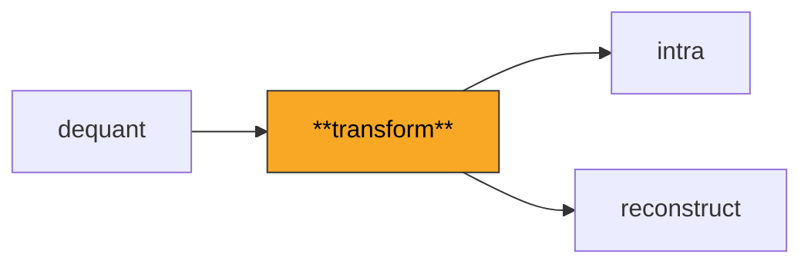
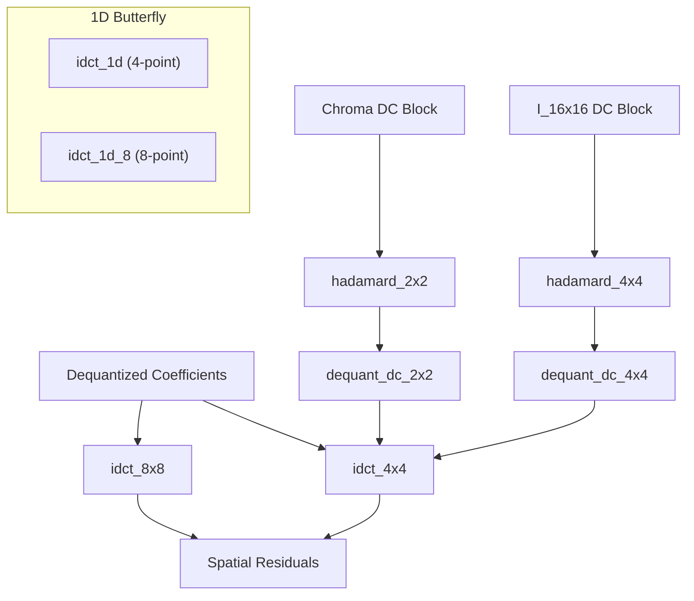

# Transform

Implements the integer inverse transforms that convert frequency-domain coefficients back to spatial-domain pixel residuals: the 4x4 and 8x8 IDCT, plus the 4x4 and 2x2 Hadamard transforms used for DC coefficient blocks.

**H.264 Spec Reference:** Section 8.5.12 (Inverse transform process)

## What It Does

H.264 encodes prediction residuals in the frequency domain using an integer approximation of the DCT. Unlike JPEG's floating-point DCT, H.264's integer transform guarantees bit-exact reconstruction across all decoder implementations -- a critical property for preventing drift in inter-predicted sequences.

The 4x4 inverse transform is the workhorse of the decoder. It uses a separable 2D approach: first apply a 1D butterfly to each column, then apply the same butterfly to each row, and finally normalize by right-shifting by 6 (dividing by 64 with rounding). The butterfly uses only additions, subtractions, and single-bit right shifts, making it simple and fast.

For I_16x16 macroblocks, the 16 DC coefficients (one per 4x4 block) undergo an additional 4x4 Hadamard transform before standard dequantization. Similarly, chroma DC coefficients (4:2:0 has 2x2 per component) use a 2x2 Hadamard. High profile adds an 8x8 inverse transform for `I_8x8` blocks, using an 8-point butterfly with more complex coefficient relationships.

## Pipeline Position



## Architecture



## Key Files

| File | Lines | Description |
|------|-------|-------------|
| `idct_4x4.py` | 363 | 4x4 IDCT, 4x4 and 2x2 Hadamard transforms, DC block processing pipelines, forward transform (for testing) |
| `idct_8x8.py` | 283 | 8x8 IDCT for High profile: 8-point butterfly matching JM `inverse8x8()`, zigzag scan tables, batch processing |
| `hadamard.py` | 15 | Chroma DC dimensions: `get_chroma_dc_dimensions` returns (W, H) based on chroma format |
| `transform_size.py` | 5 | 8x8 chroma transform predicate: `supports_8x8_chroma` checks applicability |

## Key Concepts

**4-Point Butterfly.** The core 1D inverse transform decomposes into even and odd parts:
```
e0 = x[0] + x[2]       o0 = (x[1] >> 1) - x[3]
e1 = x[0] - x[2]       o1 = x[1] + (x[3] >> 1)
output = [e0+o1, e1+o0, e1-o0, e0-o1]
```
The `>> 1` implements the H.264-specific half-pixel scaling without floating point.

**8-Point Butterfly.** The High profile 8x8 IDCT splits into a 4-element even part (using x[0], x[2], x[4], x[6]) and a 4-element odd part (using x[1], x[3], x[5], x[7]). The odd part has more complex coefficient relationships involving `>> 1` and `>> 2` shifts.

**Normalization.** Both transforms produce intermediate results that are 64 times the desired output. The final `(result + 32) >> 6` applies rounding division by 64, where the `+32` provides round-to-nearest behavior.

**Hadamard Transform.** The Hadamard matrix `H * X * H^T` is self-inverse up to scaling: applying it twice (with appropriate scaling) returns the original. For 4x4: `H = [[1,1,1,1],[1,1,-1,-1],[1,-1,-1,1],[1,-1,1,-1]]`. For 2x2: `H = [[1,1],[1,-1]]`.

**Separable 2D Transform.** The 4x4 IDCT applies the 1D butterfly to columns first, then rows. The 8x8 IDCT applies rows first, then columns — matching JM's `inverse8x8()`. The pass order matters because integer right-shift rounding is not commutative; reversing the order produces off-by-one differences that cascade through inter prediction.

## Example

```python
from transform import idct_4x4, hadamard_4x4, hadamard_2x2
from dequant import dequant_4x4, dequant_dc_4x4
import numpy as np

# Standard 4x4 inverse transform
dequantized = dequant_4x4(quantized_coeffs, qp=28)
residual = idct_4x4(dequantized)  # (4, 4) int32

# I_16x16 DC processing pipeline
dc_transformed = hadamard_4x4(dc_coeffs)   # Inverse Hadamard
dc_dequant = dequant_dc_4x4(dc_transformed, qp=28)
# dc_dequant values go into each 4x4 block's [0,0] position

# Chroma DC processing
chroma_dc = hadamard_2x2(chroma_dc_coeffs)
```

## Spec Compliance Notes

- The 8x8 IDCT pass order must be rows first, then columns. Reversing this order causes rounding differences in the `>> 1` and `>> 2` operations, leading to off-by-one pixel errors. This matches the JM reference implementation.
- The Hadamard inverse does not include normalization within the transform itself; normalization is handled by the DC-specific dequantization functions (`dequant_dc_4x4` and `dequant_dc_2x2`), which account for the transform's scaling factor.
- The `forward_4x4` and `forward_8x8` functions are included for testing round-trip accuracy, not for decoder operation. They verify that `forward(inverse(x))` recovers the original coefficients within expected rounding tolerance.
